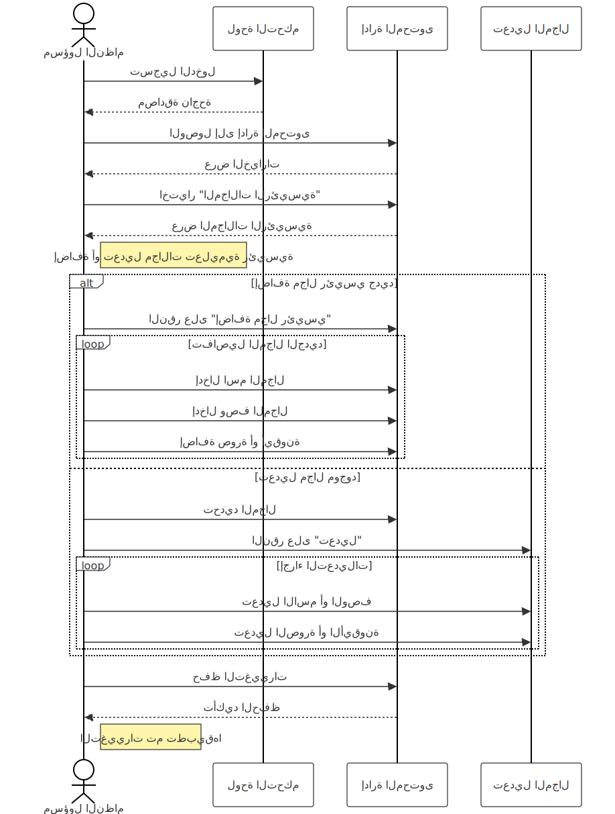
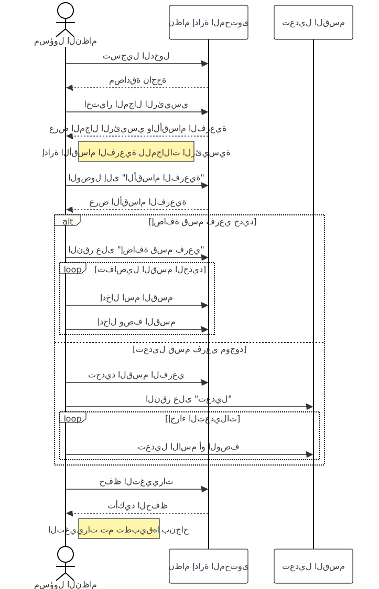
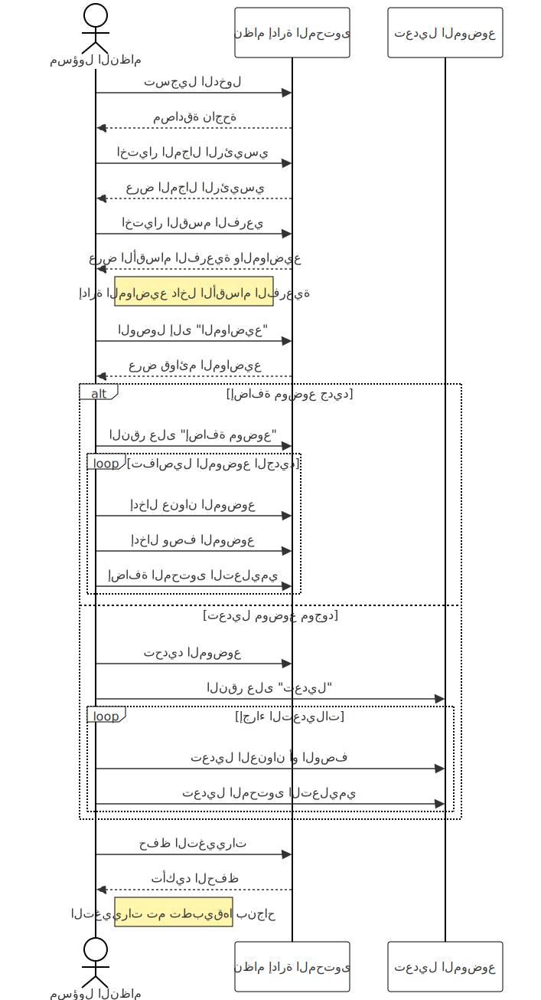
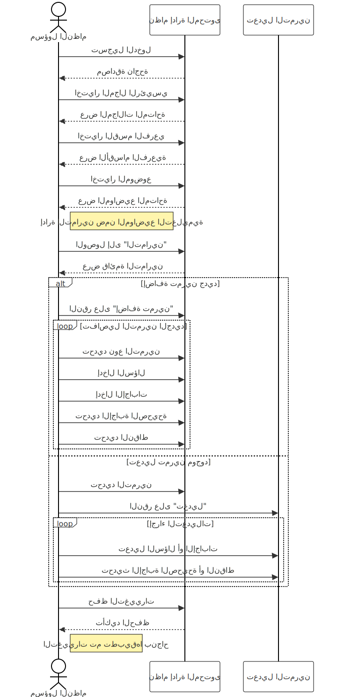

# نبذة عن المنصة
## ماذا الذي نريد بناءه؟

نسعى إلى بناء منصة تعليمية رقمية متكاملة تُحدث نقلة نوعية في إدارة العملية التعليمية، وتوفير أدوات مرنة وشاملة تدعم جميع الأطراف المعنية، من الطلاب والمعلمين إلى الإداريين والمؤسسات التعليمية. يهدف المشروع إلى تصميم نظام حاسوبي متطور يقدم حلولاً مبتكرة لإدارة وتنظيم المحتوى التعليمي، مع تمكين التفاعل والتخصيص بما يتناسب مع احتياجات المستخدمين المختلفة.

## ما الاهداف التي نريد تحقيقها من خلال المنصة؟
### **1. إدارة شاملة وفعالة**:
   - تنظيم وإدارة الطلاب، المجموعات، والمجالات التعليمية بسهولة.
   - تقديم واجهات استخدام مرنة تدعم المؤسسات التعليمية بمختلف أحجامها.

### **2. تعزيز العملية التعليمية**:
   - تمكين الطلاب من الوصول إلى محتوى تعليمي مخصص.
   - تصميم أدوات تفاعلية مثل المسابقات والاختبارات التي تعزز المشاركة والفهم.

### **3. متابعة الأداء وتحليل البيانات**:
   - توفير تقارير دقيقة ومباشرة عن أداء الطلاب والجماعات التعليمية.
   - مساعدة الجهات التعليمية على اتخاذ قرارات مستنيرة لتحسين العملية التعليمية.

### **4. توفير تجربة مستخدم متكاملة**:
   - تقديم منصة تدعم تسجيل الدخول المتعدد (طلاب، معلمين، إداريين).
   - سهولة التفاعل مع المحتوى التعليمي والأنشطة من أي مكان.

### **5. تخصيص النظام**:
   - إتاحة خيارات متنوعة لتخصيص المنصة بناءً على احتياجات الجهة التعليمية أو الطالب.
   - تقديم باقات اشتراك مرنة تشمل ميزات متنوعة تناسب مختلف المستخدمين.

### **6. تمكين الشمولية والمرونة**:
   - توفير حلول تعليمية تناسب المؤسسات الصغيرة والمتوسطة والكبيرة.
   - دعم المعلمين والطلاب في إنشاء بيئة تعليمية متكاملة وشاملة.

**خلاصة:**
بناءً على هذه الأهداف، سيتم تصميم المنصة لتكون أداة فعالة تدعم المؤسسات التعليمية في تحقيق أهدافها الأكاديمية والإدارية بكفاءة عالية.

---

## **ما مكونات المنصة؟**

هذه التعريفات والأمثلة توضح كل عنصر من عناصر المنصة التعليمية وكيفية تطبيقها في سياق التعليم العام، مما يساعد على فهم هيكلية المنصة وكيفية تفاعل المستخدمين معها لتحقيق تجربة تعليمية متكاملة.
-

### **1. الجهة**

**الوصف:**

الجهة هي مؤسسة تعليمية تستخدم المنصة لإدارة العملية التعليمية الخاصة بها. قد تكون مدرسة، مركز تدريب، أو أي منظمة تعليمية أخرى تقدم تعليمًا للطلاب من خلال المنصة.

**أمثلة:**

- **مدرسة النور الابتدائية**: تستخدم المنصة لتقديم دروس تفاعلية في مواد العلوم والرياضيات.
- **مركز الإبداع للتدريب**: يقدم دورات في مهارات الحاسوب الأساسية ويستخدم المنصة للوصول إلى الطلاب في مناطق مختلفة.
- **أكاديمية الفن الرقمي**: توفر دورات في الرسم والتصميم الجرافيكي للطلاب عن بعد.

---

### **2. المعلم**

**الوصف:**

المعلم هو الشخص المسؤول عن تقديم المحتوى التعليمي والإشراف على تعلم الطلاب. يقوم بإعداد الدروس، إنشاء التمارين والمسابقات، وتقييم أداء الطلاب.

**أمثلة:**

- **الأستاذ أحمد**: معلم رياضيات يقوم بإنشاء دروس في الهندسة وإعداد تمارين تطبيقية.
- **الأستاذة نورة**: معلمة لغة عربية تقدم محتوى تعليمي في النحو والصرف وتنظم مسابقات تفاعلية.
- **المدرب خالد**: مدرب في مهارات الحاسوب الأساسية يقوم بإعداد مواضيع في استخدام برامج معالجة النصوص.

---

### **3. الطالب**

**الوصف:**

الطالب هو المستخدم النهائي الذي يستفيد من المحتوى والأنشطة التعليمية على المنصة. يتفاعل مع الدروس، يحل التمارين، ويشارك في المسابقات.

**أمثلة:**

- **محمد علي**: طالب في الصف الخامس يستخدم المنصة لدراسة العلوم وحل التمارين.
- **سارة محمد**: طالبة في المرحلة الإعدادية تتعلم مهارات الحاسوب عبر المنصة.
- **خالد عبدالله**: طالب مهتم بتعلم أساسيات الرسم ويستخدم المنصة للوصول إلى دروس تفاعلية.

---

### **4. المجموعات**

**الوصف:**

المجموعات هي فئات من الطلاب يتم تنظيمهم معًا لأغراض تعليمية معينة، مثل فصل دراسي، أو مجموعة دراسة، أو فريق مشروع.

**أمثلة:**

- **فصل الصف الخامس (أ)**: مجموعة من الطلاب في نفس الفصل الدراسي.
- **مجموعة المتفوقين في الرياضيات**: طلاب متميزون يجتمعون لتلقي دروس متقدمة.
- **فريق مشروع العلوم**: مجموعة من الطلاب يعملون معًا على مشروع علمي.

---

### **5. المجالات**

**الوصف:**

المجالات هي الفروع التعليمية الرئيسية التي تغطيها المنصة. تمثل تصنيفًا واسعًا للمحتوى التعليمي.

**أمثلة:**

- **الرياضيات**
- **العلوم**
- **اللغة العربية**
- **مهارات الحاسوب**
- **الفنون**
- **الأسرة**
- **المجتمع**

---

### **6. الأقسام الرئيسية**

**الوصف:**

الأقسام الرئيسية هي تقسيمات داخل المجالات تساعد على تنظيم المحتوى بشكل أكثر تحديدًا.

**أمثلة:**

- في مجال **الرياضيات**:
  - **الجبر**
  - **الهندسة**
  - **الإحصاء**
- في مجال **العلوم**:
  - **الفيزياء**
  - **الكيمياء**
  - **الأحياء**
- في مجال **الفنون**:
  - **الرسم**
  - **التصميم**
  - **النحت**

---

### **7. المواضيع**

**الوصف:**

المواضيع هي وحدات تعليمية محددة داخل الأقسام الرئيسية، تغطي مفهومًا معينًا أو درسًا تفصيليًا.

**أمثلة:**

- في قسم **الجبر**:
  - **حل المعادلات الخطية**
  - **التعابير الجبرية**
- في قسم **الفيزياء**:
  - **الحركة والقوة**
  - **الطاقة والحرارة**
- في قسم **الرسم**:
  - **أساسيات الرسم بالقلم الرصاص**
  - **تقنيات التظليل**

---

### **8. التمارين**

**الوصف:**

التمارين هي أنشطة تعليمية تفاعلية تهدف إلى تعزيز فهم الطالب للمواضيع من خلال التطبيق العملي.

**أمثلة:**

- **أسئلة اختيار من متعدد** حول قوانين الحركة في الفيزياء.
- **تمارين لغوية** في اللغة العربية لتحديد الأفعال والأسماء في الجمل.
- **أسئلة صح أو خطأ** لتقييم الفهم الأساسي للمفاهيم.
- **أسئلة المطابقة** لمطابقة المصطلحات مع تعريفاتها.
- **أسئلة ملء الفراغات** لتعزيز الفهم التفصيلي للنصوص.

---

### **9. المسابقات**

**الوصف:**

المسابقات هي أنشطة تنافسية بين الطلاب تهدف إلى تحفيزهم وتشجيعهم على التعلم من خلال التحدي والمنافسة.

**أمثلة:**

- **مسابقة المعلومات الثقافية الشهرية**: حيث يتنافس الطلاب على حل الاسئلة الثقافية في وقت محدد.
- **تحدي العلوم**: أسئلة سريعة في الفيزياء والكيمياء لاختبار المعرفة العامة.

---

# أدوات المنصة وباقات الاشتراك

## الأدوات التي توفرها المنصة التعليمية

### أولاً: أدوات مسؤول المنصة
مسؤول المنصة هو المشرف الأعلى الذي يتحكم في إعداد النظام وإدارته بشكل شامل. تشمل الأدوات المتاحة له ما يلي:

**1. إدارة النظام والبنية العامة**
- **إعداد الباقات**:
  - إنشاء وإدارة باقات الاشتراك للجهات وتحديد حدود الباقات (عدد الطلاب، المجموعات، المعلمين، المميزات المتاحة).
  - إنشاء وإدارة باقات الاشتراك للافراد وتحديد حدود الباقات (المميزات المتاحة).
- **إدارة التراخيص**:
  - تفعيل أو إيقاف صلاحيات الجهات أو المستخدمين.

**2. إدارة المحتوى التعليمي**
- **إنشاء المحتوى**:
  - إنشاء محتوى المنصة (مجالات, مواضيع, ومسابقات).
- **تحديث المحتوى**:
  - تعديل وإدارة المحتوى.
- **إنشاء المسابقات**:
  - إعداد مسابقات تفاعلية تشمل أسئلة مخصصة.

**3. إدارة الجهات**
- **إنشاء حسابات الجهات**:
  - إضافة جهات جديدة وتخصيص باقة الاشتراك لكل جهة.
- **متابعة نشاط الجهات**:
  - تتبع استخدام الجهات للنظام ومراجعة مدى التزامها بالباقات.
- **توفير الدعم**:
  - أدوات لتقديم الدعم الفني والإجابة على استفسارات مسؤول الجهة.

**4. إدارة المستخدمين العامة**
- **إدارة حسابات المسؤولين**:
  - إنشاء حسابات مسؤولين جهات ومنحهم الصلاحيات.
  - متابعة نشاط الحسابات وضمان استخدامها بشكل صحيح.
- **إعداد الصلاحيات**:
  - تخصيص صلاحيات محددة لكل مسؤول جهة وفقًا لاحتياجاتها.

**5. إدارة البيانات والتقارير**
- **تتبع الأداء العام**:
  - الحصول على تقارير شاملة حول نشاط الجهات، المستخدمين، والطلاب.
- **إدارة النسخ الاحتياطية**:
  - إعداد نسخ احتياطية دورية للبيانات وحمايتها من الضياع.

**6. أدوات الأمان**
- **ضمان حماية البيانات**:
  - تطبيق سياسات أمان صارمة مثل التشفير وإدارة الوصول.
- **إدارة سجلات النشاط**:
  - مراقبة أنشطة المستخدمين على مستوى الجهة لضمان الامتثال.

---

### ثانياً: أدوات مسؤول الجهة
مسؤول الجهة هو الشخص المكلف بإدارة العملية التعليمية داخل مؤسسته باستخدام المنصة **قد يكون اكثر من مسؤول للجهة**.
تشمل الأدوات المتاحة له ما يلي :

**1. إدارة الحسابات المحلية**
- **إضافة المستخدمين**:
  - إنشاء حسابات للطلاب والمعلمين وربطهم بالمجموعات.
  - إدارة صلاحيات المعلمين داخل الجهة.
- **إدارة المجموعات**:
  - إضافة المجموعات التعليمية وربطها بالطلاب والمعلمين.
  - تنظيم توزيع الطلاب حسب المجالات الدراسية.

**2. إدارة المحتوى التعليمي**
- **تخصيص المحتوى**:
  - تخصيص محتوى **مقرر** المجموعات من (مجالات, مواضيع, ومسابقات).
- **تحديث المحتوى**:
  - تعديل وإدارة المحتوى وفقًا للمناهج أو احتياجات الجهة.
- **إنشاء المسابقات**:
  - إعداد مسابقات تفاعلية تشمل أسئلة مخصصة.

**3. تتبع تقدم الطلاب**
- **متابعة أداء الطلاب**:
  - عرض تقارير تفصيلية حول تقدم الطلاب في المجالات التعليمية.
- **إدارة التقييمات**:
  - مراجعة نتائج التمارين والمسابقات لتحديد نقاط الضعف والقوة.
- **إعادة تخصيص الأنشطة**:
  - اقتراح إعادة دراسة موضوعات معينة لتحسين أداء الطلاب.

**4. التواصل مع الطلاب والمعلمين**
- **إرسال الإشعارات**:
  - تنبيه الطلاب بالمسابقات أو المواعيد النهائية للأنشطة.
  - تقديم ملاحظات للمعلمين حول أداء الطلاب.
- **إعداد الاجتماعات**:
  - تنظيم لقاءات افتراضية أو ورش عمل ضمن المنصة.
  **ضمن المراحل المستقبلية**

**5. إدارة التقارير المحلية**
- **عرض التقارير التفصيلية**:
  - تحليل أداء الطلاب والمجموعات.
  - إنشاء تقارير خاصة لإدارة المؤسسة.

**6. طلب الدعم الفني**
- **التواصل مع مسؤول المنصة**:
  - تقديم طلبات للدعم الفني أو الإبلاغ عن مشاكل تقنية.
- **طلب ميزات إضافية**:
  - اقتراح تطوير النظام وفقًا لاحتياجات الجهة.

---

### ثالثاً: أدوات الطالب
الطالب هو المستخدم النهائي الذي يستفيد من المحتوى والأنشطة التعليمية. تشمل الأدوات:

**1. أدوات الوصول إلى المحتوى**
- تصفح المجالات التعليمية، الأقسام، والمواضيع المتاحة.
- الوصول إلى التمارين، الفيديوهات، والمحتوى التفاعلي.

**2. أدوات التقييم والتفاعل**
- المشاركة في التمارين والمسابقات وتقديم الإجابات.
- تلقي نتائج التمارين وتحليل أدائه الشخصي.
- تلقي إشعارات حول الأنشطة والمواعيد النهائية.

**3. أدوات تتبع التقدم**
- عرض شريط التقدم الذي يظهر مستواه في المواضيع المختلفة.
- تقارير أداء توضح النقاط التي تحتاج إلى تحسين.
- عرض نسبة التقدم في الأنشطة والمجالات.

**4. أدوات المراجعة والتطوير**
- تلقي توصيات من النظام لتحسين الأداء في المواضيع الضعيفة.
- إمكانية طلب إعادة دراسة موضوع معين.

**5. أدوات الدعم والتواصل**
- التفاعل مع المعلمين للحصول على توجيهات.
- إرسال استفسارات عبر النظام.

---

### ملخص الفرق بين الأدوات

| **الأدوات**                     | **مسؤول المنصة**                              | **مسؤول الجهة**                              | **الطالب**                                   |
|---------------------------------|---------------------------------------------|---------------------------------------------|---------------------------------------------|
| **إدارة الحسابات**              | إنشاء الجهات وتخصيص الصلاحيات              | إنشاء الطلاب والمعلمين والمجموعات          | التسجيل في النظام وإنشاء الحساب الشخصي       |
| **إدارة الباقات**               | إعداد الباقات والاشتراكات                   | اختيار الباقة المناسبة للجهة                | اختيار باقة فردية                                   |
| **إدارة المحتوى**               | إنشاء وتعديل محتوى المنصة                         | تخصيص محتوى مجموعات الجهة            | الوصول إلى المحتوى المتاح فقط               |
| **إدارة التقارير**              | تقارير شاملة عن أداء الجهات                 | تقارير تفصيلية عن أداء الطلاب والمجموعات    | عرض تقارير التقدم الشخصي وأداء التمارين      |
| **التقييم والمسابقات**          | مراقبة النشاط العام للمسابقات              | إعداد المسابقات ومراجعة نتائج الطلاب         | المشاركة في التمارين والمسابقات             |
| **الدعم الفني**                 | توفير الدعم الفني لجميع الجهات              | طلب الدعم الفني وحل المشاكل الخاصة بالجهة    | طلب المساعدة من المعلمين داخل المنصة         |
| **إدارة البيانات**              | النسخ الاحتياطي والتحكم الكامل بالنظام       | إدارة بيانات الطلاب والمعلمين داخل الجهة   | استعراض بيانات التقدم الشخصي والأنشطة        |
| **التفاعل والتواصل**            | التواصل مع مسؤولي الجهات                   | إرسال إشعارات وتنبيهات للطلاب والمعلمين      | التفاعل مع المعلمين واستلام الإشعارات        |

### تفاصيل إضافية

- **مسؤول المنصة**: يركز على إدارة النظام والبنية الأساسية للمنصة، بما في ذلك إعداد الباقات و المحتوى التعليمي وتخصيص الصلاحيات.
- **مسؤول الجهة**: يتحكم في إدارة الطلاب والمعلمين داخل مؤسسته، مع مسؤولية تخصيص المحتوى وتتبع الأداء.
- **الطالب**: يستخدم المنصة للتعلم من خلال الوصول إلى المحتوى، المشاركة في الأنشطة، وتتبع تقدمه الشخصي.

---

## باقات الاشتراك المقترحة

### 1. باقات اشتراك خاصة بالطلاب 
**اشتراكات فردية**

 **الباقات المقترحة للطلاب**

| الباقة              | السعر الشهري (بالريال السعودي) | الميزات الرئيسية                                     | الجمهور المستهدف                              |
|---------------------|-------------------------|------------------------------------------------------|-----------------------------------------------|
| **الأساسية**       | 5-10                    | الوصول الأساسي للمحتوى وتتبع محدود                   | الطلاب الجدد أو المستكشفين للنظام             |
| **المتوسطة**       | 15-20                   | الوصول الكامل للمواد، تمارين غير محدودة، تتبع مفصل   | الطلاب المتعلمين بعمق                         |
| **المتقدمة**       | 30-40                   | خطط دراسية شخصية، توصيات للتحسين                     | الطلاب الطموحين المهتمين بالتحسين المستمر     |
| **المحترفين**      | 50-70                   | محتوى متميز، شارات وإنجازات، تقارير أداء شاملة       | الطلاب المتفوقون والمتطلعون لتجربة شاملة     |
| **التميز**         | 100-150                 | تخصيص كامل، دعم استشاري، ورش عمل افتراضية           | الطلاب الذين يسعون لتحقيق أداء تعليمي استثنائي|

---

### 2. باقات اشتراك خاصة بالجهات
**باقات للمؤسسات التعليمية**

**أسعار الباقات المقترحة للجهات**

| الباقة                | السعر الشهري (بالريال السعودي) | عدد الطلاب | عدد المجموعات | عدد المعلمين | الميزات الرئيسية                                                                                             | الجمهور المستهدف                                      |
|-----------------------|-------------------------|-------------|----------------|--------------|--------------------------------------------------------------------------------------------------------------|-------------------------------------------------------|
| **الباقة الأساسية**   | 50-100                  | حتى 50      | حتى 3          | 1            | وصول كامل إلى المحتوى، تتبع التقدم في المجالات الرئيسية فقط، دعم فني عبر البريد الإلكتروني.          | الجهات الصغيرة أو المدارس المبتدئة.                  |
| **الباقة المتقدمة**   | 150-200                 | حتى 150     | حتى 10         | 3            | وصول كامل إلى المحتوى، تتبع الأداء بتفاصيل أكثر، تخصيص المحتوى وإنشاء مسابقات، دعم عبر البريد الإلكتروني. | المؤسسات المتوسطة الحجم التي تحتاج إلى إدارة موسعة. |
| **الباقة الاحترافية** | 300-500                 | حتى 300     | حتى 20         | 6            | وصول كامل إلى المحتوى، تقارير أداء شاملة، إشعارات تلقائية للطلاب والمعلمين، دعم فني عبر الهاتف والبريد.    | المدارس والمؤسسات التعليمية الكبيرة.                |
| **باقة المؤسسات**     | 700-1000                | حتى 1000    | حتى 50         | 20           | ميزات كاملة لإدارة المحتوى، تقارير تحليلية متقدمة، تخصيص النظام ودمجه مع أنظمة خارجية، دعم فني مستمر.        | المؤسسات التعليمية والشركات الكبيرة.                 |
| **باقة التميز**       | 1500-2000               | حتى 2000    | حتى 100        | 50           | تخصيص كامل للنظام، خطة مراجعة شخصية، تقارير مفصلة، دعم خاص واستشارات تعليمية، حضور ورش عمل.               | الجامعات والمؤسسات التعليمية الموسعة.               |

**جدول ملخص لميزات باقات الجهات**

| الباقة                | عدد الطلاب | عدد المجموعات | عدد المعلمين | ميزات المحتوى                                      | ميزات التتبع والتقارير                           | دعم فني                       | الفئات المستهدفة                               |
|-----------------------|------------|---------------|--------------|---------------------------------------------------|--------------------------------------------------|--------------------------------|------------------------------------------------|
| **الباقة الأساسية**   | حتى 50     | حتى 3        | 1            | الوصول الكامل إلى جميع المحتويات                        | تتبع تقدم الطالب في المجالات الرئيسية فقط         | بريد إلكتروني فقط              | الجهات الصغيرة أو المدارس المبتدئة             |
| **الباقة المتقدمة**   | حتى 150    | حتى 10       | 3            | الوصول الكامل، مع إمكانية تخصيص محتوى المجموعات (مجالات)               | تتبع مفصل للتقدم يشمل المجالات والأقسام الفرعية   | بريد إلكتروني سريع             | المؤسسات المتوسطة الحجم                         |
| **الباقة الاحترافية** | حتى 300    | حتى 20       | 6            | الوصول الكامل، مع إمكانية تخصيص محتوى المجموعات (مجالات ومسابقات)                  | تقارير أداء شاملة على مستوى الطالب والمجموعات    | بريد إلكتروني وهاتف خلال ساعات العمل | المدارس والمؤسسات الكبيرة                       |
| **باقة المؤسسات**     | حتى 1000   | حتى 50       | 20           | الوصول الكامل، مع إمكانية تخصيص محتوى المجموعات           | تقارير تحليلية متقدمة مع تتبع مستمر              | دعم فني متواصل                 | المؤسسات التعليمية والشركات الكبيرة             |
| **باقة التميز**       | حتى 2000   | حتى 100      | 50           | تخصيص كامل للمحتوى وإنشاء خطط دراسية خاصة         | تقارير مفصلة، وإشراف مخصص لتحسين الأداء          | دعم فني واستشارات تعليمية خاصة  | الجامعات والمؤسسات التعليمية الموسعة            |

### منصات مشابهة تقدم باقات متعددة

 **أمثلة على منصات تعليمية تقدم باقات اشتراك مماثلة**

| المنصة                               | الباقات الرئيسية                                    | تفاصيل الباقات                                                                                                                         |
|--------------------------------------|-----------------------------------------------------|-----------------------------------------------------------------------------------------------------------------------------------------|
| **Google Workspace for Education**    | Education Fundamentals، Education Standard، ...     | تتراوح من مجانية إلى باقات مدفوعة تشمل ميزات إضافية للأمان وإدارة البيانات وتحليل الأداء.                                              |
| **Microsoft Teams for Education**     | Office 365 A1، Office 365 A3، Office 365 A5         | الباقات تتفاوت في دعم ميزات الأمان، وتحليل الأداء، والوصول الكامل إلى أدوات Microsoft.                                                |
| **Kahoot! for Schools**               | Basic، Pro، Premium، Premium+                       | من باقة مجانية إلى باقات مدفوعة بميزات إضافية للتفاعل وإدارة المحتوى وتحليل الأداء.                                                     |
| **Canvas LMS**                        | Basic، Advanced، Enterprise                         | تشمل باقات للتعليم الأساسي والمتوسط، وتتيح تخصيص كامل للجامعات والمؤسسات الكبيرة.                                                      |
| **Schoology by PowerSchool**          | Basic، Enterprise                                  | توفر باقات مع ميزات إدارة المحتوى، تقارير الأداء، ودعم للتكامل مع الأنظمة الأخرى.                                                      |
| **Moodle for Education and Corporates** | Standard، Professional، Enterprise                 | تشمل الباقات ميزات تخصيص النظام، وإدارة المستخدمين، وتحليل الأداء، وتلائم المدارس والشركات الكبيرة.                                   |

---

# واجهات المنصة
## **محتوى الواجهة الرئيسية لمسؤول النظام (مسؤول المنصة)**

مسؤول النظام هو المشرف الأعلى على المنصة، ويكون مسؤولًا عن إدارة البنية التحتية، المحتوى التعليمي، وإدارة الاشتراكات والتراخيص. الواجهة الرئيسية لمسؤول النظام يجب أن توفر نظرة شاملة عن حالة المنصة وتمكنه من الوصول السريع إلى الأدوات الأساسية.

---

### **المحتوى الأكثر أولوية في الواجهة الرئيسية**

#### **1. لوحة التحكم الرئيسية**:
   - **إحصائيات عامة**: معلومات فورية عن حالة المنصة (عدد المجالات، الأقسام، المواضيع، التمارين، المشتركين).
   - **تنبيهات وإشعارات**: مشكلات تحتاج إلى اهتمام فوري، مثل انتهاء اشتراك جهة، أو أخطاء تقنية.

#### **2. الوصول السريع إلى أدوات الإدارة**:
   - **إدارة المحتوى التعليمي**: إمكانية إنشاء وتعديل المجالات، الأقسام، المواضيع، التمارين، والمسابقات.
   - **إدارة الاشتراكات والباقات**: إنشاء وتعديل الباقات، إدارة المشتركين، ومراقبة التراخيص.

#### **3. التقارير والتحليلات**:
   - **تقارير الاستخدام**: مدى استخدام المنصة من قبل المشتركين.
   - **تحليلات الأداء**: أداء المحتوى التعليمي ومدى تفاعل المستخدمين معه.

#### **4. أدوات الأمان والنسخ الاحتياطي**:
   - **إشعارات الأمان**: تحذيرات عن محاولات الدخول غير المصرح بها.
   - **حالة النسخ الاحتياطية**: معلومات عن آخر نسخة احتياطية وحالتها.

---

### **كيفية توفير المحتوى في الحالات التالية**

#### **الحالة الأولى: المنصة فارغة كليًا (عند بدء التهيئة)**

**طريقة العرض:**

##### **1. شاشة ترحيبية**:
   - رسالة ترحيبية بمسؤول النظام توضح أنه لم يتم إعداد المنصة بعد.

##### **2. دليل البدء السريع**:
   - **خطوات إرشادية** تساعد المسؤول في إعداد المنصة.
   - **معالج تهيئة** (Setup Wizard) يقود المسؤول خلال الخطوات الأساسية.

##### **3. أزرار دعوة للإجراء (Call to Action)**:
   - **إنشاء مجال جديد**: للبدء في بناء المحتوى التعليمي.
   - **إعداد الباقات**: لتحديد باقات الاشتراك.
   - **إضافة جهات أو مستخدمين**: للبدء في إضافة المشتركين.

**أولوية المحتوى:**

- **توجيه المسؤول**: الهدف هو مساعدة مسؤول النظام على البدء بسرعة في إعداد المنصة.
- **توفير الأدوات الأساسية**: إتاحة الوصول السريع إلى مهام الإعداد الرئيسية.

---

#### **الحالة الثانية: المنصة تحتوي على مجالات فارغة**
مجالات دون أقسام فرعية أو مواضيع أو تمارين أو مسابقات

**طريقة العرض:**

##### **1. لوحة التحكم الرئيسية**:

   - **إحصائيات عامة**:
     - عدد المجالات: **يعرض عدد المجالات الموجودة**.
     - الأقسام الفرعية، المواضيع، التمارين، المسابقات: **يعرض أنها صفر**.

##### **2. تنبيهات**:

   - إشعار بأن المجالات **تحتاج إلى محتوى إضافي**.
   - اقتراح **إضافة أقسام فرعية** لكل مجال.

##### **3. قائمة المجالات**:

   - عرض **المجالات الموجودة** مع أزرار **إضافة قسم فرعي** بجانب كل مجال.

##### **4. أدوات الوصول السريع**:

   - **إضافة قسم فرعي جديد**.
   - **إدارة المحتوى التعليمي** للوصول إلى إنشاء المواضيع والتمارين.

**أولوية المحتوى:**

- **استكمال بناء المحتوى**: تنبية المسؤول ليقوم بإضافة الأقسام الفرعية والمواضيع  لتنشيط المجالات وإثراء المحتوى التعليمي فيها.
- **توفير رؤى عن النقص**: إبراز المجالات التي تحتاج إلى تطوير.

---

#### **الحالة الثالثة: المنصة تحتوي على محتوى كامل بدون مشتركين**

**طريقة العرض:**

##### **1. لوحة التحكم الرئيسية**:

   - **إحصائيات المحتوى**:
     - عدد المجالات، الأقسام الفرعية، المواضيع، التمارين، المسابقات.
   - **إحصائيات المشتركين**:
     - عدد الجهات: **0**.
     - عدد الطلاب: **0**.

##### **2. تنبيهات**:

   - إشعار بأنه **لا يوجد مشتركين** في المنصة.
   - اقتراح **إضافة جهات جديدة** أو **الترويج للمنصة**.

##### **3. أدوات الوصول السريع**:

   - **إضافة جهة جديدة**.
   - **إعداد باقات الاشتراك** للتأكد من أن الباقات جاهزة للمشتركين.

##### **4. تقارير وتحليلات**:

   - عرض **تحليلات عن المحتوى** ومدى جاهزيته.
   - إمكانية **معاينة المنصة** كما يراها الطالب أو الجهة.

**أولوية المحتوى:**

- **جذب المشتركين**: حث المسؤول على البدء في جلب جهات أو طلاب للمنصة.
- **التأكد من جاهزية المنصة**: ضمان أن المحتوى مكتمل وجاهز للاستخدام.

---

#### **الحالة الرابعة: المنصة تحتوي على محتوى كامل مع وجود طلاب فقط**

**طريقة العرض:**

##### **1. لوحة التحكم الرئيسية**:

   - **إحصائيات المحتوى**: كما في الحالات السابقة.
   - **إحصائيات المشتركين**:
     - عدد الطلاب: **يظهر العدد الفعلي**.
     - عدد الجهات: **0**.

##### **2. تنبيهات**:

   - إشعارات عن **نشاط الطلاب**.
   - تنبيهات عن **الطلاب الجدد** الذين انضموا مؤخرًا.

##### **3. تقارير وتحليلات**:

   - **تقدم الطلاب** في المحتوى التعليمي.
   - **أكثر المواضيع أو التمارين شعبية**.

##### **4. أدوات الوصول السريع**:

   - **إدارة الطلاب**: عرض قائمة الطلاب، إمكانية التواصل معهم، ومتابعة نشاطهم.
   - **إعداد باقات الاشتراك الفردية**: مراجعة الباقات والتأكد من ملاءمتها.

**أولوية المحتوى:**

- **متابعة أداء الطلاب**: مراقبة كيفية تفاعل الطلاب مع المحتوى.
- **تحسين التجربة**: جمع الملاحظات لتحسين المحتوى أو المنصة.

---

#### **الحالة الخامسة: المنصة تحتوي على محتوى كامل مع وجود جهات فقط**

**طريقة العرض:**

##### **1. لوحة التحكم الرئيسية**:

   - **إحصائيات المحتوى**: كما في السابق.
   - **إحصائيات المشتركين**:
     - عدد الجهات: **يظهر العدد الفعلي**.
     - عدد الطلاب: **قد يظهر العدد الإجمالي للطلاب ضمن الجهات**.

##### **2. تنبيهات**:

   - إشعارات عن **نشاط الجهات**: مثل جهة جديدة انضمت، أو جهة اقترب اشتراكها من الانتهاء.
   - **طلبات دعم** من الجهات.

##### **3. تقارير وتحليلات**:

   - **استخدام الجهات للمنصة**: عدد المستخدمين، التفاعل مع المحتوى.
   - **أداء المحتوى** داخل الجهات.

##### **4. أدوات الوصول السريع**:

   - **إدارة الجهات**: عرض قائمة الجهات، تعديل اشتراكاتهم، التواصل مع مسؤولي الجهات.
   - **إعداد الباقات المؤسسية**: مراجعة الباقات والتأكد من تلبيتها لاحتياجات الجهات.

**أولوية المحتوى:**

- **دعم الجهات**: التأكد من أن الجهات تستفيد من المنصة بكفاءة.
- **مراقبة التزام الجهات**: متابعة مدى استخدامهم للمنصة والامتثال لشروط الاشتراك.

---

#### **الحالة السادسة: المنصة تحتوي على محتوى كامل مع وجود جهات وطلاب**

**طريقة العرض:**

##### **1. لوحة التحكم الرئيسية**:

   - **إحصائيات شاملة**:
     - عدد المجالات، الأقسام، المواضيع، التمارين، المسابقات.
     - عدد الجهات.
     - عدد الطلاب (مستقلين ومنضمين عبر الجهات).

##### **2. تنبيهات**:

   - **نشاطات مهمة**:
     - تسجيل طلاب جدد.
     - جهات جديدة انضمت.
     - مشكلات تقنية أو طلبات دعم.

##### **3. تقارير وتحليلات**:

   - **مقارنة بين أداء** الطلاب المستقلين وطلاب الجهات.
   - **تحليلات متقدمة** عن استخدام المحتوى والتفاعل معه.

##### **4. أدوات الوصول السريع**:

   - **إدارة الطلاب** و**إدارة الجهات** بشكل متكامل.
   - **إعداد الباقات**: الفردية والمؤسسية.
   - **إدارة المحتوى**: تحديث وتحسين المحتوى بناءً على تفاعل المستخدمين.

**أولوية المحتوى:**

- **التوازن بين احتياجات الجهات والطلاب المستقلين**: ضمان أن كلا الفئتين تحصلان على أفضل تجربة.
- **تحسين المنصة بناءً على التغذية الراجعة**: جمع الملاحظات من الجهات والطلاب لتحسين المحتوى والوظائف.

---

### **عناصر تصميم مشتركة لتحسين تجربة مسؤول النظام**

- **واجهة مستخدم ديناميكية**: تتكيف مع حالة المنصة وتعكس المعلومات الأكثر أهمية.
- **تنبيهات ذكية**: تقديم إشعارات مرتبة حسب الأولوية والحاجة للتدخل.
- **لوحات معلومات قابلة للتخصيص**: السماح لمسؤول النظام بتحديد ما يظهر في الواجهة الرئيسية.
- **تقارير تفاعلية**: إمكانية النقر على الإحصائيات للوصول إلى تفاصيل أكثر.
- **أدوات بحث وتصفية متقدمة**: للعثور على معلومات محددة بسرعة.

---

### **تطبيق تصميم الواجهة لتحقيق الأولويات في كل حالة**

#### **الحالة الأولى: المنصة فارغة كليًا**

- **تركيز على الإعداد**: جعل الأدوات والروابط المتعلقة بإعداد المنصة بارزة.
- **معالج تهيئة**: توفير خطوات إرشادية تفاعلية تساعد المسؤول على إعداد المحتوى والباقات.

#### **الحالة الثانية: مجالات بدون أقسام أو مواضيع**

- **تنبية وحدث لإستكمال المحتوى**: إبراز الأقسام التي تحتاج إلى تطوير، وتوفير أزرار سريعة لإضافة المحتوى.

#### **الحالة الثالثة: محتوى كامل بدون مشتركين**

- **توجيه نحو التسويق وجذب المشتركين**: توفير أدوات أو نصائح للترويج للمنصة وجذب الجهات والطلاب.

#### **الحالة الرابعة: وجود طلاب فقط**

- **متابعة أداء الطلاب**: عرض تحليلات عن كيفية تفاعل الطلاب مع المحتوى، وأي تحديات يواجهونها.

#### **الحالة الخامسة: وجود جهات فقط**

- **دعم الجهات**: التركيز على توفير أدوات لإدارة العلاقات مع الجهات ومساعدتهم على استخدام المنصة بفعالية.

#### **الحالة السادسة: وجود جهات وطلاب**

- **التوازن في المعلومات**: تقديم نظرة شاملة تجمع بين أداء الجهات والطلاب المستقلين.
- **تقسيم الواجهة**: ربما تقسيم لوحة التحكم إلى أقسام تخص الجهات وأخرى تخص الطلاب.

---

### **خلاصة**

- **الواجهة الرئيسية لمسؤول النظام يجب أن تكون ديناميكية وقابلة للتكيف** بناءً على حالة المنصة.
- **الأولوية هي توفير المعلومات والأدوات الأكثر أهمية** لمساعدة مسؤول النظام في إدارة المنصة بكفاءة.
- **في كل حالة، يجب أن تركز الواجهة على الأهداف الرئيسية**: سواء كان ذلك إعداد المنصة، استكمال المحتوى، جذب المشتركين، أو متابعة الأداء.
- **تصميم واجهة مستخدم مرنة وقابلة للتخصيص** سيساعد مسؤول النظام على التركيز على المهام الأكثر أهمية وتحقيق أهداف المنصة بشكل أفضل.

من خلال فهم احتياجات مسؤول النظام في كل حالة، يمكن تصميم واجهة رئيسية تقدم تجربة مستخدم ممتازة وتساعد في تحقيق النجاح للمنصة التعليمية.

---

## **محتوى الواجهة الرئيسية لمسؤول الجهة**

الواجهة الرئيسية لمسؤول الجهة هي نقطة الانطلاق لإدارة العملية التعليمية داخل المؤسسة. يجب أن تكون مصممة لتوفير رؤية شاملة وسهلة للوصول إلى الأدوات والمعلومات الأكثر أهمية، مما يساعد على اتخاذ قرارات مستنيرة وإدارة المهام بكفاءة.

### **المحتوى الأكثر أولوية في الواجهة الرئيسية**

#### **1. لوحة التحكم الرئيسية**:
   - **إحصائيات عامة**: عدد الطلاب، المعلمين، المجموعات.
   - **مؤشرات الأداء الرئيسية**: تقدم الطلاب، نشاط المعلمين، اكتمال المهام.

#### **2. التنبيهات والإشعارات**:
   - طلبات الانضمام الجديدة.
   - مواعيد الأنشطة القادمة.
   - إشعارات حول مشكلات تقنية أو تحديثات النظام.

#### **3. الوصول السريع إلى الأدوات الإدارية**:
   - إدارة المستخدمين (طلاب، معلمين).
   - إدارة المجموعات.
   - تخصيص المحتوى التعليمي.

#### **4. التقارير والتحليلات**:
   - تقارير تفصيلية عن أداء الطلاب والمجموعات.
   - تحليل نتائج المسابقات والتمارين.

#### **5. التواصل والتفاعل**:
   - رسائل واردة من المعلمين أو الطلاب.
   - إمكانية إرسال إشعارات أو رسائل جماعية.

---

### **كيفية توفير المحتوى في الحالات التالية**

#### **الحالة الأولى: مسؤول الجهة يشرف على المعلمين والمجموعات والطلاب**

في هذه الحالة، يكون دور مسؤول الجهة إداريًا بحتًا، يركز على إدارة المؤسسة التعليمية بكافة عناصرها.

**طريقة العرض:**

##### **1. لوحة التحكم الرئيسية**:

   - **إحصائيات فورية**:
     - عدد **المعلمين** المسجلين والنشطين.
     - عدد **الطلاب** الإجمالي والنشطين.
     - عدد **المجموعات** الحالية.

   - **مخططات بيانية**:
     - **تقدم الطلاب** في مختلف المجالات.
     - **معدل النشاط** للمعلمين (مثل عدد الدروس المقدمة).

##### **2. التنبيهات والإشعارات**:

   - **طلبات انضمام جديدة** من طلاب أو معلمين.
   - **مواعيد هامة**: مثل بدء دورة جديدة أو انتهاء اشتراك.
   - **مشكلات تحتاج إلى تدخل**: مثل طالب لم يكمل مهامه.

##### **3. الوصول السريع إلى الأدوات الإدارية**:

   - **إدارة المستخدمين**:
     - زر **"إضافة مستخدم جديد"** (طالب أو معلم).
     - **قائمة المستخدمين** مع إمكانية البحث والتصفية.

   - **إدارة المجموعات**:
     - زر **"إنشاء مجموعة جديدة"**.
     - **قائمة المجموعات** مع معلومات عن عدد الأعضاء.

   - **تخصيص المحتوى التعليمي**:
     - الوصول إلى **"تخصيص المحتوى"** للمجموعات.
     - إمكانية **تعديل المحتوى** المخصص لكل مجموعة.

##### **4. التقارير والتحليلات**:

   - روابط سريعة إلى **تقارير الأداء**.
   - **تنزيل التقارير** بصيغ مختلفة (PDF، Excel).

##### **5. التواصل والتفاعل**:

   - **صندوق الوارد** للرسائل من المعلمين أو الطلاب.
   - إمكانية **إرسال إشعارات جماعية**.

**أولوية المحتوى:**

- **الإدارة الشاملة**: توفير نظرة عامة على كل العناصر الأساسية.
- **اتخاذ القرارات**: سهولة الوصول إلى المعلومات لاتخاذ إجراءات سريعة.
- **التفاعل الفعال**: أدوات تواصل مباشرة مع المعلمين والطلاب.

---

#### **الحالة الثانية: مسؤول الجهة هو معلم يشرف على عدة مجموعات وطلاب**

في هذه الحالة، يجمع مسؤول الجهة بين الدور الإداري ودور المعلم، مما يتطلب واجهة تلبي احتياجات كلا الدورين.

**طريقة العرض:**

##### **1. لوحة تحكم مدمجة**:

   - **قسم إداري**:
     - **إحصائيات إدارية** مثل الحالة العامة للمؤسسة.
     - **إشعارات إدارية**: مثل طلبات الانضمام.

   - **قسم تعليمي**:
     - **قائمة المجموعات التعليمية** التي يشرف عليها.
     - **مخططات تقدم الطلاب** في مجموعاته.

##### **2. التنقل السهل بين الأدوار**:

   - **أزرار أو علامات تبويب** للتبديل بين **"وضع الإدارة"** و**"وضع المعلم"**.
   - **تخصيص الواجهة** بناءً على الوضع المختار.

##### **3. في وضع المعلم:**

   - **الوصول السريع إلى المجموعات**:

     - **قائمة المجموعات** مع معلومات سريعة (عدد الطلاب، المهام القادمة).
     - إمكانية **اختيار مجموعة** لعرض تفاصيلها.

   - **متابعة تقدم الطلاب**:

     - **عرض تقارير** عن كل طالب.
     - **إشعارات** حول الطلاب الذين يحتاجون إلى دعم إضافي.

   - **إدارة المحتوى التعليمي**:

     - **إنشاء وتعديل التمارين والمسابقات** للمجموعات.
     - **تخصيص المحتوى** بناءً على احتياجات الطلاب.

   - **التواصل مع الطلاب**:

     - **صندوق الوارد** للرسائل من الطلاب.
     - إمكانية **إرسال إشعارات أو رسائل** لمجموعة أو طالب محدد.

##### **4. في وضع الإدارة:**

   - **إدارة المستخدمين**:

     - إضافة أو تعديل **المعلمين الآخرين**.
     - إدارة **صلاحيات** المعلمين.

   - **إدارة المجموعات والمؤسسة**:

     - إنشاء **مجموعات جديدة** وتعيين معلمين لها.
     - **متابعة الأداء العام** للمؤسسة.

**أولوية المحتوى:**

- **التكامل بين الأدوار**: توفير تجربة سلسة تجمع بين المهام الإدارية والتعليمية.
- **الكفاءة في المهام**: تسهيل الوصول إلى الأدوات اللازمة لكل دور.
- **التركيز على الطلاب**: في دور المعلم، يكون التركيز على تقدم الطلاب واحتياجاتهم.

---

### **عناصر مشتركة لتحسين تجربة مسؤول الجهة**

- **تخصيص الواجهة**: السماح لمسؤول الجهة بتخصيص ما يظهر في الواجهة الرئيسية بناءً على أولوياته.
- **إشعارات ذكية**: تقديم إشعارات مرتبة حسب الأهمية، مع إمكانية **تصفية** الإشعارات.
- **شريط بحث شامل**: للبحث عن طلاب، معلمين، مجموعات، أو محتوى بسرعة.
- **تدريب ومساعدة**: توفير **أدلة** أو **مقاطع فيديو** تساعد المسؤول في استخدام المنصة بكفاءة.

---

### **تصميم الواجهة لتحقيق الأولويات**

#### **1. لوحة التحكم الرئيسية**

- **تصميم مرئي جذاب** مع **مخططات بيانية** ومؤشرات أداء.
- **أزرار وصول سريع** إلى المهام الشائعة (إضافة مستخدم، إنشاء مجموعة).

#### **2. التنبيهات والإشعارات**

- **مركز إشعارات** واضح يمكن الوصول إليه من أي مكان.
- **أيقونات تنبيه** بجانب الأقسام التي تحتاج إلى انتباه.

#### **3. إدارة المستخدمين والمجموعات**

- **جداول** تعرض المستخدمين مع إمكانية **الفرز والتصفية**.
- **إجراءات مجمعة** لتسهيل المهام (مثل إرسال رسالة لجميع المعلمين).

#### **4. التقارير والتحليلات**

- **لوحات معلومات تفاعلية** تمكن من **تخصيص الفترة الزمنية** أو **المقاييس** المعروضة.
- **تنزيل التقارير** للاحتفاظ بها أو مشاركتها مع الإدارة.

#### **5. التواصل والتفاعل**

- **نظام مراسلة داخلي** مع **تنبيهات** عند وصول رسائل جديدة.
- **إمكانية إنشاء منتديات** أو **نقاشات جماعية** مع المعلمين.

---

### **خلاصة**

- **مسؤول الجهة الذي يشرف على المعلمين والمجموعات والطلاب** يحتاج إلى واجهة تركز على الإدارة الشاملة، مع أدوات للوصول السريع إلى المعلومات واتخاذ القرارات.
- **مسؤول الجهة الذي يجمع بين دور الإدارة والتعليم** يحتاج إلى واجهة متكاملة تسمح له بالتنقل بسهولة بين المهام الإدارية والتعليمية، مع تركيز على دعم الطلاب والتفاعل معهم.
- **الأولوية** هي توفير معلومات دقيقة وسهلة الوصول، مع تصميم واجهة مستخدم تساعد على زيادة الكفاءة وتحسين تجربة المستخدم.

من خلال تصميم واجهة مستخدم مرنة ومخصصة، يمكننا تلبية احتياجات مسؤول الجهة في كلا السيناريوهين، مما يساعد على تعزيز العملية التعليمية وتحقيق أهداف المؤسسة.

---
## **محتوى الواجهة الرئيسية للطالب**

الواجهة الرئيسية للطالب هي نقطة الدخول الأساسية للتفاعل مع المنصة، ويجب أن تكون مصممة لتلبية احتياجات الطالب بناءً على حالته وارتباطاته داخل المنصة. الهدف هو تقديم تجربة مستخدم مخصصة تساعد الطالب على البدء والتقدم في رحلته التعليمية.

### **المحتوى الأكثر أولوية في الواجهة الرئيسية**

#### **1. المحتوى المخصص**: المجالات والمواضيع المرتبطة بالطالب من خلال الجهات أو المجموعات.
#### **2. التنبيهات والإشعارات**: مثل المهام الجديدة، المواعيد النهائية، والرسائل من المعلمين أو المسؤولين.
#### **3. التقدم الشخصي**: شريط أو لوحة تعرض تقدم الطالب في المجالات أو المواضيع المحددة.
#### **4. الاقتراحات**: توصيات لمجالات أو مواضيع جديدة بناءً على اهتمامات الطالب أو نشاطه السابق.

### **الحالات المختلفة وكيفية تقديم المحتوى**

#### **1. الطالب جديد ولم يحدد أي مجالات أو غير مرتبط بأي مجموعات أو جهات**

**طريقة العرض:**

- **شاشة ترحيبية مخصصة**:
  - رسالة ترحيبية تحمل اسم الطالب.
  - توجيه بسيط يشرح الخطوات الأولى لاستخدام المنصة 

- **دليل البدء السريع**:
  - عرض **دليل تفاعلي** يساعد الطالب على فهم كيفية استخدام المنصة.
  - خطوات لإنشاء مسار تعليمي شخصي.
  **يجب وضع آلية تحديد ذلك من قبل الإدارة من خلال تصميم نظام قياس معياري او ما شابه**

- **اقتراحات المجالات والمواضيع**:
  - قائمة **بالمجالات الأكثر شيوعًا** أو **الأعلى تقييمًا**.
  - **فلاتر** تساعد الطالب على اختيار المجالات بناءً على اهتماماته (مثل العلوم، الرياضيات، اللغات).

- **زر "ابدأ الآن" أو "استكشف"**:
  - يحث الطالب على البدء في استكشاف المحتوى المتاح.

**أولوية المحتوى:**
- **تسهيل البداية**: الهدف الرئيسي هو مساعدة الطالب على البدء بسرعة وسلاسة.
- **تخصيص التجربة**: تشجيع الطالب على اختيار المجالات التي تهمه لإنشاء تجربة تعليمية مخصصة.

---

#### **2. الطالب قد اجتاز بعض المجالات أو الأقسام أو المواضيع**

**طريقة العرض:**

- **لوحة تقدم شخصية**:
  - **شريط تقدم** يظهر نسبة الإنجاز في المجالات المختلفة.
  - **إحصائيات** حول المواضيع المكتملة والمواضيع المتبقية.

- **المحتوى المستمر**:
  - قسم **"أكمل من حيث توقفت"** يعرض آخر المواضيع أو التمارين التي كان يعمل عليها الطالب.
  - **تذكير بالمهام القادمة** أو التمارين المتاحة.

- **توصيات للتعلم المستقبلي**:
  - اقتراح **مجالات أو مواضيع جديدة** بناءً على ما تم اجتيازه.
  - **توصيات** لتحسين النقاط الضعيفة بناءً على أداء الطالب.

- **إنجازات وشارات**:
  - عرض **الشارات** أو **الإنجازات** التي حصل عليها الطالب.
  - تحفيز الطالب من خلال **تحديات جديدة**.

**أولوية المحتوى:**

- **متابعة التقدم**: مساعدة الطالب على رؤية تقدمه وتشجيعه على الاستمرار.
- **تحفيز الاستكشاف**: تقديم محتوى جديد ومناسب لمستوى الطالب الحالي.

---

#### **3. الطالب جديد وتم ربطه مع جهة أو مجموعة**

**طريقة العرض:**

- **تنبيهات وترحيب من الجهة أو المجموعة**:
  - رسالة ترحيبية من **مسؤول الجهة** أو **المعلم**.
  - **إشعارات** بالمهام أو الأنشطة المقررة.

- **المحتوى المخصص للجهة أو المجموعة**:
  - عرض **المجالات والمواضيع** التي تم تخصيصها للطالب من قبل الجهة.
  - **جدول زمني** يظهر المواعيد النهائية والأنشطة القادمة.

- **التواصل والتفاعل**:
  - قسم **"رسائل"** للتواصل مع المعلمين أو أعضاء المجموعة.
  - **منتديات أو نقاشات** خاصة بالمجموعة (إذا كانت متوفرة) **في الاصدار +1.3.0**.

- **أدوات الدعم**:
  - معلومات حول **كيفية طلب المساعدة** أو **الدعم الفني**.
  - **موارد إضافية** مقدمة من الجهة.

**أولوية المحتوى:**

- **الاندماج مع الجهة**: مساعدة الطالب على فهم دوره داخل الجهة أو المجموعة.
- **توجيه التركيز**: توجيه الطالب نحو المحتوى والأنشطة المحددة من قبل الجهة.

---

#### **4. الطالب جديد وتم ربطه مع عدة جهات وعدة مجموعات**

**طريقة العرض:**

- **لوحة تحكم شاملة**:
  - **ملخصات** لكل جهة أو مجموعة مرتبطة بالطالب.
  - إمكانية **التنقل بسهولة** بين الجهات أو المجموعات.

- **جدول زمني موحد**:
  - **تقويم** يعرض جميع المواعيد النهائية والأنشطة من جميع الجهات والمجموعات.
  - **تنبيهات** بالأحداث القادمة مع إمكانية **فلتره** المحتوى حسب الجهة ,المجموعة ,المجال أو الحالة وغيره.

- **المحتوى المخصص**:
  - أقسام منفصلة أو علامات تبويب لكل **جهة** أو **مجموعة**.
  - **المجالات والمواضيع** المرتبطة بكل جهة معروضة بوضوح.

- **التنبيهات والإشعارات**:
  - **مركز إشعارات** يجمع جميع الرسائل والتنبيهات من مختلف الجهات.
  - إمكانية **تحديد الأولويات** أو **وضع إشعارات مخصصة**.

- **التواصل والتفاعل المتعدد**:
  - أدوات للتواصل مع **معلمين** و**طلاب** من مختلف الجهات.
  - **منتديات** أو **مجموعات نقاش** لكل جهة أو مجموعة **في الاصدار +1.3.0**.

**أولوية المحتوى:**

- **تنظيم المعلومات**: مساعدة الطالب على **إدارة وقته** والتزاماته عبر الجهات المختلفة.
- **تجنب التشتيت**: تقديم **واجهة منظمة** لتجنب الارتباك بسبب كثرة المحتوى.
- **تسهيل الوصول**: ضمان أن الطالب يمكنه الوصول بسرعة إلى المحتوى والأنشطة ذات الأولوية.

---

### **تطبيق تصميم الواجهة في كل حالة**

#### **الحالة الأولى: طالب جديد بدون ارتباطات**

- **الهدف**: تشجيع الطالب على اختيار مجالات اهتمامه والبدء في التعلم.
- **التطبيق**:
  - استخدام **تصميم بسيط ونظيف** يركز على الدعوة إلى الإجراء (Call to Action).
  - **إبراز أزرار** مثل "اختر مجالاتك المفضلة" أو "ابدأ التعلم الآن".
  - توفير **مرشح اهتمامات** يساعد الطالب على تحديد ما يود تعلمه.

#### **الحالة الثانية: طالب اجتاز محتوى معين**

- **الهدف**: تحفيز الطالب على الاستمرار وتقديم رؤية واضحة لتقدمه.
- **التطبيق**:
  - استخدام **لوحات تقدم مرئية** مثل الرسوم البيانية أو الشارات.
  - توفير **روابط سريعة** للمواضيع التالية أو الموصى بها.
  - تقديم **تغذية راجعة** إيجابية حول الإنجازات.

#### **الحالة الثالثة: طالب جديد مرتبط بجهة أو مجموعة واحدة**

- **الهدف**: توجيه الطالب نحو المحتوى والأنشطة المخصصة له من قبل الجهة.
- **التطبيق**:
  - **إبراز** المحتوى والمهام المخصصة من قبل الجهة في أعلى الصفحة.
  - عرض **رسائل ترحيبية** أو تعليمات من مسؤول الجهة.
  - توفير **أدوات تواصل** مع المعلمين أو المسؤولين.

#### **الحالة الرابعة: طالب جديد مرتبط بعدة جهات ومجموعات**

- **الهدف**: تنظيم المحتوى والأنشطة من مختلف الجهات بطريقة سهلة الإدارة.
- **التطبيق**:
  - إنشاء **علامات تبويب** أو **أقسام** لكل جهة أو مجموعة.
  - تقديم **تقويم موحد** مع إمكانية التصفية.
  - توفير **تنبيهات مخصصة** لكل جهة مع إمكانية تحديد الأولويات.

### **عناصر تصميم مشتركة لتحسين تجربة الطالب**

- **شريط بحث ذكي**: للسماح للطالب بالبحث عن مواضيع أو مجالات بسهولة.
- **دعم متعدد اللغات**: لتلبية احتياجات الطلاب من خلفيات لغوية مختلفة **في الاصدار +1.3.0**.
- **إمكانية التخصيص**: السماح للطالب بتخصيص الواجهة بناءً على تفضيلاته.
- **توافق مع الأجهزة المختلفة**: ضمان أن الواجهة تعمل بشكل ممتاز على الحواسيب والأجهزة المحمولة.

**خلاصة**

- **الواجهة الرئيسية للطالب** يجب أن تكون **ديناميكية** وتتغير بناءً على حالة الطالب وارتباطاته داخل المنصة.
- **الأولوية** هي تقديم المحتوى الأكثر صلة ومساعدة الطالب على **التركيز** على ما هو مهم بالنسبة له.
- من خلال **تصميم موجه** و**مخصص**، يمكننا تحسين تجربة الطالب وزيادة فعالية العملية التعليمية.

---

# عمليات المنصة
## عمليات مسؤول النظام (مسؤول المنصة)

**مسؤول النظام** هو الشخص الذي يدير البنية التحتية للمنصة ويضمن تشغيلها بكفاءة. العمليات الرئيسية ومسار تنفيذ كل عملية كالتالي:

### 1. إدارة النظام والبنية العامة

**أ. إعداد الباقات**

**الهدف**: إنشاء وإدارة باقات الاشتراك للجهات والأفراد، وتحديد حدود وميزات كل باقة.

**خطوات العملية**:

#### **1. تسجيل الدخول**:
   - **المسؤول** يقوم بتسجيل الدخول إلى لوحة التحكم الخاصة بالنظام.

#### **2. الوصول إلى إدارة الباقات**:
   - ينتقل إلى قسم **"إدارة الباقات"** في القائمة الرئيسية.

#### **3. إنشاء باقة جديدة**:
   - ينقر على زر **"إنشاء باقة جديدة"**.
   - يحدد نوع الباقة (جهة أو فردية).
   - يدخل التفاصيل:
     - **اسم الباقة**.
     - **السعر الشهري**.
     - **الميزات المتاحة** (عدد الطلاب، المجموعات، المعلمين، المميزات الخاصة).

#### **4. تحديد الحدود والصلاحيات**:
   - يحدد **الحد الأقصى للمستخدمين** والموارد المسموح بها في الباقة.
   - يخصص **الصلاحيات** المتاحة للمستخدمين ضمن الباقة.

#### **5. حفظ وتفعيل الباقة**:
   - ينقر على **"حفظ"**.
   - يتأكد من **تفعيل الباقة** لتصبح متاحة للاختيار من قبل الجهات أو الأفراد.

**مخطط تسلسلي Sequence Diagram**:

---

**ب. إدارة التراخيص**

**الهدف**: تفعيل أو إيقاف صلاحيات الجهات أو المستخدمين بناءً على الاشتراك أو الاستخدام.

**خطوات العملية**:

1. **الوصول إلى إدارة التراخيص**:
   - من لوحة التحكم، ينتقل إلى قسم **"إدارة التراخيص"**.

2. **عرض قائمة الجهات/المستخدمين**:
   - يستعرض **قائمة الجهات أو الأفراد** المشتركة في المنصة.

3. **تفعيل أو إيقاف الترخيص**:
   - يحدد الجهة أو المستخدم المطلوب.
   - ينقر على **"تعديل الحالة"**.
   - يختار بين **"تفعيل"** أو **"إيقاف"** الصلاحيات.

4. **تأكيد العملية**:
   - يتلقى رسالة تأكيد.
   - ينقر على **"تأكيد"** لإتمام العملية.

**مخطط تسلسلي Sequence Diagram**:

---

### 2. إدارة المحتوى التعليمي

**تشمل أدوات إدارة المحتوى للمسؤول ما يلي:**

- **إنشاء وتعديل المجالات الرئيسية**.
- **إنشاء وتعديل الأقسام الفرعية**.
- **إنشاء وتعديل المواضيع**.
- **إنشاء وتعديل التمارين**.

---

#### **أ. إنشاء وتعديل المجالات الرئيسية**

**الهدف**: إنشاء مجالات تعليمية رئيسية جديدة أو تعديل المجالات الموجودة.

**خطوات العملية**:

1. **الوصول إلى قسم إدارة المحتوى** في لوحة التحكم.
2. **اختيار "المجالات الرئيسية"** من القائمة.
3. **لإنشاء مجال رئيسي جديد**:
   - النقر على زر **"إضافة مجال رئيسي"**.
   - إدخال **اسم المجال** و**وصفه**.
   - إضافة **صورة** أو **أيقونة** للمجال.
4. **لتعديل مجال موجود**:
   - تحديد المجال من القائمة.
   - النقر على زر **"تعديل"**.
   - إجراء التعديلات المطلوبة.
5. **حفظ التغييرات** بالنقر على **"حفظ"**.

**مخطط تسلسلي Sequence Diagram**:

---

#### **ب. إنشاء وتعديل الأقسام الفرعية**

**الهدف**: إنشاء أقسام فرعية تحت المجالات الرئيسية أو تعديلها.

**خطوات العملية**:

1. **اختيار المجال الرئيسي** الذي ترغب في إضافة قسم فرعي له.
2. **النقر على "الأقسام الفرعية"** ضمن المجال المحدد.
3. **لإنشاء قسم فرعي جديد**:
   - النقر على زر **"إضافة قسم فرعي"**.
   - إدخال **اسم القسم** و**وصفه**.
4. **لتعديل قسم فرعي موجود**:
   - تحديد القسم الفرعي من القائمة.
   - النقر على زر **"تعديل"**.
   - إجراء التعديلات المطلوبة.
5. **حفظ التغييرات**.

**مخطط تسلسلي Sequence Diagram**:

---

#### **ج. إنشاء وتعديل المواضيع**

**الهدف**: إضافة مواضيع تعليمية داخل الأقسام الفرعية أو تعديلها.

**خطوات العملية**:

1. **اختيار المجال الرئيسي** ثم **القسم الفرعي** المعني.
2. **النقر على "المواضيع"** ضمن القسم الفرعي.
3. **لإنشاء موضوع جديد**:
   - النقر على زر **"إضافة موضوع"**.
   - إدخال **عنوان الموضوع** و**وصفه**.
   - إضافة **المحتوى التعليمي** (نصوص، صور، فيديوهات، ملفات).
4. **لتعديل موضوع موجود**:
   - تحديد الموضوع من القائمة.
   - النقر على زر **"تعديل"**.
   - إجراء التعديلات المطلوبة.
5. **حفظ التغييرات**.

**مخطط تسلسلي Sequence Diagram**:

---

#### **د. إنشاء وتعديل التمارين**

**الهدف**: إضافة تمارين أو اختبارات مرتبطة بالمواضيع التعليمية أو تعديلها.

**خطوات العملية**:

1. **اختيار المجال الرئيسي** > **القسم الفرعي** > **الموضوع** المعني.
2. **النقر على "التمارين"** ضمن الموضوع.
3. **لإنشاء تمرين جديد**:
   - النقر على زر **"إضافة تمرين"**.
   - تحديد **نوع التمرين** (اختيار من متعدد، صح أو خطأ، إجابة قصيرة، إلخ).
   - إدخال **السؤال**.
   - إدخال **الإجابات المحتملة** وتحديد **الإجابة الصحيحة**.
   - تحديد **النقاط** المخصصة للتمرين.
4. **لتعديل تمرين موجود**:
   - تحديد التمرين من القائمة.
   - النقر على زر **"تعديل"**.
   - إجراء التعديلات المطلوبة.
5. **حفظ التغييرات**.

**مخطط تسلسلي Sequence Diagram**:

---

### 3. إدارة الجهات

**أ. إنشاء حسابات الجهات**

**الهدف**: إضافة جهات جديدة وتخصيص باقة الاشتراك لكل جهة.

**خطوات العملية**:

1. **الوصول إلى إدارة الجهات**:
   - من لوحة التحكم، يختار **"إدارة الجهات"**.

2. **إضافة جهة جديدة**:
   - ينقر على **"إضافة جهة"**.
   - يدخل معلومات الجهة:
     - **اسم الجهة**.
     - **بيانات الاتصال**.
     - **معلومات المسؤول الأساسي**.

3. **تحديد الباقة**:
   - يختار **الباقة المناسبة** للجهة من قائمة الباقات المتاحة.

4. **حفظ وإرسال التفاصيل**:
   - ينقر على **"حفظ"**.
   - يتم **إرسال تفاصيل تسجيل الدخول** إلى مسؤول الجهة عبر البريد الإلكتروني.

**مخطط تسلسلي Sequence Diagram**:

---

### 4. إدارة المستخدمين العامة

**أ. إدارة حسابات المسؤولين**

**الهدف**: إنشاء حسابات لمسؤولي الجهات ومنحهم الصلاحيات المناسبة.

**خطوات العملية**:

1. **الوصول إلى إدارة المستخدمين**:
   - من لوحة التحكم، ينتقل إلى **"إدارة المستخدمين"**.

2. **إضافة مسؤول جهة جديد**:
   - ينقر على **"إضافة مستخدم"**.
   - يختار **"مسؤول جهة"** كنوع المستخدم.
   - يدخل التفاصيل:
     - **الاسم**.
     - **البريد الإلكتروني**.
     - **كلمة المرور المؤقتة**.

3. **تخصيص الصلاحيات**:
   - يحدد **الصلاحيات الممنوحة** لمسؤول الجهة.
   - يربطه بالجهة المعنية.

4. **حفظ وإشعار المستخدم**:
   - ينقر على **"حفظ"**.
   - يتم **إرسال إشعار** للمستخدم بتفاصيل الحساب.

**مخطط تسلسلي Sequence Diagram**:

---

### 5. إدارة البيانات والتقارير

**أ. تتبع الأداء العام**

**الهدف**: الحصول على تقارير شاملة حول نشاط الجهات والمستخدمين.

**خطوات العملية**:

1. **الوصول إلى التقارير**:
   - من لوحة التحكم، يختار **"التقارير"**.

2. **تحديد نوع التقرير**:
   - يختار **"تقارير الجهات"** أو **"تقارير المستخدمين"**.

3. **تحديد الفترة الزمنية**:
   - يحدد **الفترة الزمنية** المطلوبة للتقرير.

4. **عرض التقرير**:
   - ينقر على **"عرض التقرير"**.
   - يستعرض البيانات والتحليلات.

5. **تنزيل أو مشاركة التقرير**:
   - يمكنه **تنزيل التقرير** بصيغة محددة.
   - أو **مشاركته** مع جهات أخرى إذا لزم الأمر.

**مخطط تسلسلي Sequence Diagram**:

---

## عمليات مسؤول الجهة

**مسؤول الجهة** يدير العملية التعليمية داخل مؤسسته. العمليات الرئيسية ومسار تنفيذ كل عملية كالتالي:

### 1. إدارة الحسابات المحلية

**أ. إضافة المستخدمين**

**الهدف**: إنشاء حسابات للطلاب والمعلمين وربطهم بالمجموعات.

**خطوات العملية**:

1. **تسجيل الدخول**:
   - **مسؤول الجهة** يسجل الدخول إلى لوحة تحكم الجهة.

2. **الوصول إلى إدارة المستخدمين**:
   - ينتقل إلى قسم **"إدارة المستخدمين"**.

3. **إضافة مستخدم جديد**:
   - ينقر على **"إضافة مستخدم"**.
   - يختار نوع المستخدم (**طالب** أو **معلم**).

4. **إدخال تفاصيل المستخدم**:
   - **الاسم الكامل**.
   - **البريد الإلكتروني**.
   - **كلمة المرور المؤقتة**.

5. **ربط بالمجموعات**:
   - يحدد **المجموعة** أو **المجموعات** التي ينتمي إليها المستخدم.

6. **تحديد الصلاحيات (للمعلمين)**:
   - يخصص **الصلاحيات** المناسبة للمعلمين.

7. **حفظ وإشعار المستخدم**:
   - ينقر على **"حفظ"**.
   - يتم **إرسال بريد إلكتروني** للمستخدم بتفاصيل الحساب.

**مخطط تسلسلي Sequence Diagram**:

---

**ب. إدارة المجموعات**

**الهدف**: إضافة المجموعات التعليمية وتنظيم الطلاب والمعلمين.

**خطوات العملية**:

1. **الوصول إلى إدارة المجموعات**:
   - من لوحة التحكم، يختار **"إدارة المجموعات"**.

2. **إنشاء مجموعة جديدة**:
   - ينقر على **"إضافة مجموعة"**.
   - يدخل **اسم المجموعة** ووصفها.

3. **تحديد المجالات الدراسية**:
   - يختار **المجالات الدراسية** المرتبطة بالمجموعة.

4. **إضافة الطلاب والمعلمين**:
   - يحدد **الطلاب** الذين سينضمون إلى المجموعة.
   - يضيف **المعلمين** المسؤولين عن المجموعة.

5. **حفظ المجموعة**:
   - ينقر على **"حفظ"** لإتمام العملية.

**مخطط تسلسلي Sequence Diagram**:

---

### 2. إدارة المحتوى التعليمي

**أ. تخصيص المحتوى**

**الهدف**: تخصيص محتوى المقررات للمجموعات من مجالات، مواضيع، ومسابقات.

**خطوات العملية**:

1. **الوصول إلى إدارة المحتوى**:
   - ينتقل إلى **"إدارة المحتوى"** في لوحة التحكم.

2. **اختيار المجموعة**:
   - يحدد **المجموعة** التي يرغب في تخصيص المحتوى لها.

3. **تحديد المجالات والمواضيع**:
   - يختار **المجالات التعليمية** المطلوبة.
   - يضيف أو يزيل **مواضيع** معينة.

4. **إعداد المسابقات**:
   - ينقر على **"إنشاء مسابقة"**.
   - يحدد **نوع المسابقة** و**الأسئلة**.

5. **تعيين المحتوى**:
   - يربط المحتوى بالمجموعة والطلاب المعنيين.

6. **حفظ التعديلات**:
   - ينقر على **"حفظ"** لتطبيق التغييرات.

**مخطط تسلسلي Sequence Diagram**:

---

### 3. تتبع تقدم الطلاب

**أ. متابعة أداء الطلاب**

**الهدف**: عرض تقارير تفصيلية حول تقدم الطلاب في المجالات التعليمية.

**خطوات العملية**:

1. **الوصول إلى تقارير الأداء**:
   - من لوحة التحكم، يختار **"تقارير الأداء"**.

2. **تحديد المجموعة أو الطالب**:
   - يختار **مجموعة** معينة أو **طالب** محدد.

3. **عرض التقرير**:
   - يستعرض **التقارير** التي تظهر:
     - **نسبة التقدم**.
     - **الدرجات** في المسابقات.
     - **المواضيع المكتملة**.

4. **تحليل البيانات**:
   - يحدد **نقاط القوة والضعف** لدى الطلاب.

5. **اتخاذ الإجراءات**:
   - يقرر **إعادة تخصيص** أنشطة أو مواضيع للطلاب المحتاجين.

**مخطط تسلسلي Sequence Diagram**:

---

## عمليات الطالب

**الطالب** هو المستخدم النهائي الذي يتفاعل مع المحتوى التعليمي. العمليات الرئيسية ومسار تنفيذ كل عملية كالتالي:

### 1. الوصول إلى المحتوى

**الهدف**: تصفح المجالات التعليمية والمواضيع والوصول إلى المواد التعليمية.

**خطوات العملية**:

1. **تسجيل الدخول**:
   - **الطالب** يدخل **اسم المستخدم** و**كلمة المرور** في صفحة تسجيل الدخول.

2. **الوصول إلى الصفحة الرئيسية**:
   - ينتقل إلى **الصفحة الرئيسية** التي تعرض المقررات والمجالات المتاحة.

3. **تصفح المجالات**:
   - يختار **المجال التعليمي** الذي يرغب في دراسته.

4. **اختيار الموضوع**:
   - يستعرض **المواضيع** ضمن المجال.
   - ينقر على **موضوع** محدد.

5. **الوصول إلى المحتوى**:
   - يستعرض **المواد التعليمية**:
     - **نصوص**.
     - **فيديوهات**.
     - **تمارين تفاعلية**.

**مخطط تسلسلي Sequence Diagram**:

---

### 2. المشاركة في التمارين والمسابقات

**الهدف**: التفاعل مع التمارين والمسابقات لتعزيز الفهم وتقييم الأداء.

**خطوات العملية**:

1. **تلقي إشعار**:
   - **الطالب** يتلقى **إشعارًا** بوجود مسابقة جديدة أو تمرين.

2. **الوصول إلى قسم التمارين**:
   - ينتقل إلى **"التمارين والمسابقات"** من القائمة.

3. **اختيار التمرين أو المسابقة**:
   - يحدد **التمرين** المطلوب.

4. **بدء التمرين**:
   - ينقر على **"بدء التمرين"**.

5. **الإجابة على الأسئلة**:
   - يقرأ **السؤال**.
   - يختار **الإجابة** أو يكتبها.

6. **إرسال الإجابات**:
   - بعد الانتهاء، ينقر على **"إرسال"**.

7. **استلام النتائج**:
   - يتلقى **النتيجة** فورًا أو بعد تقييم المعلم.

**مخطط تسلسلي Sequence Diagram**:

---

### 3. تتبع التقدم

**الهدف**: عرض ومتابعة التقدم الشخصي في المجالات والمواضيع.

**خطوات العملية**:

1. **الوصول إلى لوحة التقدم**:
   - ينقر على **"لوحة التقدم"** من القائمة.

2. **استعراض التقدم**:
   - يشاهد **نسبة الإنجاز** في كل مجال وموضوع.

3. **تحليل الأداء**:
   - يستعرض **التقارير** التي تظهر:
     - **نقاط القوة**.
     - **المجالات التي تحتاج إلى تحسين**.

4. **وضع خطط للتحسين**:
   - يقرر **إعادة دراسة** مواضيع معينة.
   - يستخدم **المواد الإضافية** المتاحة.

**مخطط تسلسلي Sequence Diagram**:

---

### خلاصة

- **مسؤول النظام** يقوم بإعداد وإدارة البنية التحتية للمنصة، بما في ذلك الباقات والتراخيص والجهات.
- **مسؤول الجهة** يدير المستخدمين والمحتوى داخل مؤسسته، ويتابع أداء الطلاب.
- **الطالب** يتفاعل مع المحتوى التعليمي، ويشارك في الأنشطة، ويتابع تقدمه.

**استخدام الخطوات التفصيلية أعلاه يساعد في تصميم وتطوير المنصة بطريقة منظمة، ويضمن توفير تجربة مستخدم سلسة لجميع الأطراف.**
