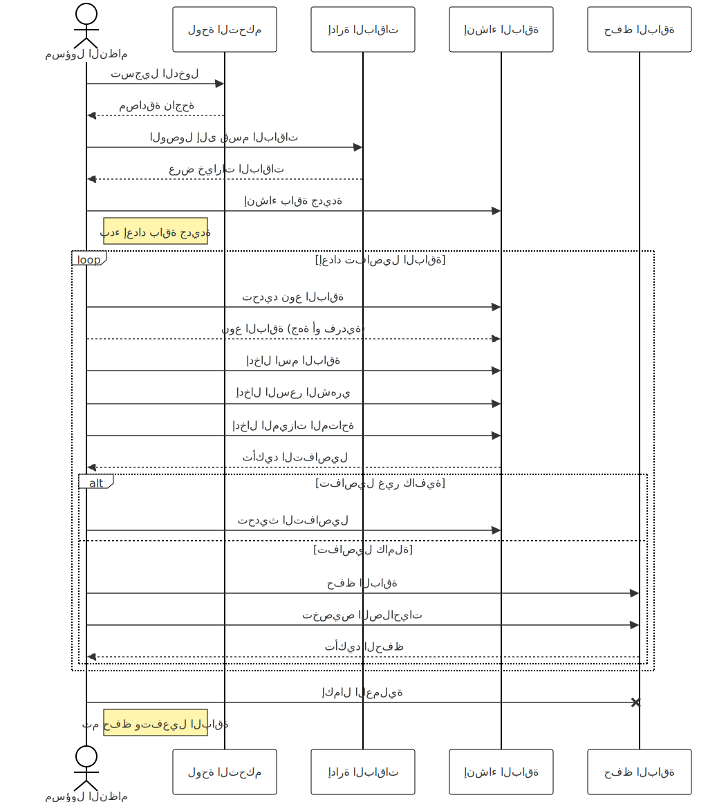

## نبذة عن المشروع
### ماذا نريد بناءه؟

نسعى إلى بناء منصة تعليمية رقمية متكاملة تُحدث نقلة نوعية في إدارة العملية التعليمية، وتوفير أدوات مرنة وشاملة تدعم جميع الأطراف المعنية، من الطلاب والمعلمين إلى الإداريين والمؤسسات التعليمية. يهدف المشروع إلى تصميم نظام حاسوبي متطور يقدم حلولاً مبتكرة لإدارة وتنظيم المحتوى التعليمي، مع تمكين التفاعل والتخصيص بما يتناسب مع احتياجات المستخدمين المختلفة.

### ما الاهداف التي نريد تحقيقها من خلال المنصة؟
1. **إدارة شاملة وفعالة**:
   - تنظيم وإدارة الطلاب، المجموعات، والمجالات التعليمية بسهولة.
   - تقديم واجهات استخدام مرنة تدعم المؤسسات التعليمية بمختلف أحجامها.

2. **تعزيز العملية التعليمية**:
   - تمكين الطلاب من الوصول إلى محتوى تعليمي مخصص.
   - تصميم أدوات تفاعلية مثل المسابقات والاختبارات التي تعزز المشاركة والفهم.

3. **متابعة الأداء وتحليل البيانات**:
   - توفير تقارير دقيقة ومباشرة عن أداء الطلاب والجماعات التعليمية.
   - مساعدة الجهات التعليمية على اتخاذ قرارات مستنيرة لتحسين العملية التعليمية.

4. **توفير تجربة مستخدم متكاملة**:
   - تقديم منصة تدعم تسجيل الدخول المتعدد (طلاب، معلمين، إداريين).
   - سهولة التفاعل مع المحتوى التعليمي والأنشطة من أي مكان.

5. **تخصيص النظام**:
   - إتاحة خيارات متنوعة لتخصيص المنصة بناءً على احتياجات الجهة التعليمية أو الطالب.
   - تقديم باقات اشتراك مرنة تشمل ميزات متنوعة تناسب مختلف المستخدمين.

6. **تمكين الشمولية والمرونة**:
   - توفير حلول تعليمية تناسب المؤسسات الصغيرة والمتوسطة والكبيرة.
   - دعم المعلمين والطلاب في إنشاء بيئة تعليمية متكاملة وشاملة.

**خلاصة:**
بناءً على هذه الأهداف، سيتم تصميم المنصة لتكون أداة فعالة تدعم المؤسسات التعليمية في تحقيق أهدافها الأكاديمية والإدارية بكفاءة عالية.

---

### الأدوات التي توفرها المنصة التعليمية


#### أولاً: أدوات مسؤول المنصة
مسؤول المنصة هو المشرف الأعلى الذي يتحكم في إعداد النظام وإدارته بشكل شامل. تشمل الأدوات المتاحة له ما يلي:


**1. إدارة النظام والبنية العامة**
- **إعداد الباقات**:
  - إنشاء وإدارة باقات الاشتراك للجهات وتحديد حدود الباقات (عدد الطلاب، المجموعات، المعلمين، المميزات المتاحة).
  - إنشاء وإدارة باقات الاشتراك للافراد وتحديد حدود الباقات (المميزات المتاحة).
- **إدارة التراخيص**:
  - تفعيل أو إيقاف صلاحيات الجهات أو المستخدمين.


**2. إدارة المحتوى التعليمي**
- **إنشاء المحتوى**:
  - إنشاء محتوى المنصة (مجالات, مواضيع, ومسابقات).
- **تحديث المحتوى**:
  - تعديل وإدارة المحتوى.
- **إنشاء المسابقات**:
  - إعداد مسابقات تفاعلية تشمل أسئلة مخصصة.

**3. إدارة الجهات**
- **إنشاء حسابات الجهات**:
  - إضافة جهات جديدة وتخصيص باقة الاشتراك لكل جهة.
- **متابعة نشاط الجهات**:
  - تتبع استخدام الجهات للنظام ومراجعة مدى التزامها بالباقات.
- **توفير الدعم**:
  - أدوات لتقديم الدعم الفني والإجابة على استفسارات مسؤول الجهة.


**4. إدارة المستخدمين العامة**
- **إدارة حسابات المسؤولين**:
  - إنشاء حسابات مسؤولين جهات ومنحهم الصلاحيات.
  - متابعة نشاط الحسابات وضمان استخدامها بشكل صحيح.
- **إعداد الصلاحيات**:
  - تخصيص صلاحيات محددة لكل مسؤول جهة وفقًا لاحتياجاتها.


**5. إدارة البيانات والتقارير**
- **تتبع الأداء العام**:
  - الحصول على تقارير شاملة حول نشاط الجهات، المستخدمين، والطلاب.
- **إدارة النسخ الاحتياطية**:
  - إعداد نسخ احتياطية دورية للبيانات وحمايتها من الضياع.


**6. أدوات الأمان**
- **ضمان حماية البيانات**:
  - تطبيق سياسات أمان صارمة مثل التشفير وإدارة الوصول.
- **إدارة سجلات النشاط**:
  - مراقبة أنشطة المستخدمين على مستوى الجهة لضمان الامتثال.

---


#### ثانياً: أدوات مسؤول الجهة
مسؤول الجهة هو الشخص المكلف بإدارة العملية التعليمية داخل مؤسسته باستخدام المنصة **قد يكون اكثر من مسؤول للجهة**.
تشمل الأدوات المتاحة له ما يلي :

**1. إدارة الحسابات المحلية**
- **إضافة المستخدمين**:
  - إنشاء حسابات للطلاب والمعلمين وربطهم بالمجموعات.
  - إدارة صلاحيات المعلمين داخل الجهة.
- **إدارة المجموعات**:
  - إضافة المجموعات التعليمية وربطها بالطلاب والمعلمين.
  - تنظيم توزيع الطلاب حسب المجالات الدراسية.


**2. إدارة المحتوى التعليمي**
- **تخصيص المحتوى**:
  - تخصيص محتوى **مقرر** المجموعات من (مجالات, مواضيع, ومسابقات).
- **تحديث المحتوى**:
  - تعديل وإدارة المحتوى وفقًا للمناهج أو احتياجات الجهة.
- **إنشاء المسابقات**:
  - إعداد مسابقات تفاعلية تشمل أسئلة مخصصة.


**3. تتبع تقدم الطلاب**
- **متابعة أداء الطلاب**:
  - عرض تقارير تفصيلية حول تقدم الطلاب في المجالات التعليمية.
- **إدارة التقييمات**:
  - مراجعة نتائج التمارين والمسابقات لتحديد نقاط الضعف والقوة.
- **إعادة تخصيص الأنشطة**:
  - اقتراح إعادة دراسة موضوعات معينة لتحسين أداء الطلاب.


**4. التواصل مع الطلاب والمعلمين**
- **إرسال الإشعارات**:
  - تنبيه الطلاب بالمسابقات أو المواعيد النهائية للأنشطة.
  - تقديم ملاحظات للمعلمين حول أداء الطلاب.
- **إعداد الاجتماعات**:
  - تنظيم لقاءات افتراضية أو ورش عمل ضمن المنصة.
  **ضمن المراحل المستقبلية**

**5. إدارة التقارير المحلية**
- **عرض التقارير التفصيلية**:
  - تحليل أداء الطلاب والمجموعات.
  - إنشاء تقارير خاصة لإدارة المؤسسة.


**6. طلب الدعم الفني**
- **التواصل مع مسؤول المنصة**:
  - تقديم طلبات للدعم الفني أو الإبلاغ عن مشاكل تقنية.
- **طلب ميزات إضافية**:
  - اقتراح تطوير النظام وفقًا لاحتياجات الجهة.

---

#### ثالثاً: أدوات الطالب
الطالب هو المستخدم النهائي الذي يستفيد من المحتوى والأنشطة التعليمية. تشمل الأدوات:


**1. أدوات الوصول إلى المحتوى**
- تصفح المجالات التعليمية، الأقسام، والمواضيع المتاحة.
- الوصول إلى التمارين، الفيديوهات، والمحتوى التفاعلي.


**2. أدوات التقييم والتفاعل**
- المشاركة في التمارين والمسابقات وتقديم الإجابات.
- تلقي نتائج التمارين وتحليل أدائه الشخصي.
- تلقي إشعارات حول الأنشطة والمواعيد النهائية.


**3. أدوات تتبع التقدم**
- عرض شريط التقدم الذي يظهر مستواه في المواضيع المختلفة.
- تقارير أداء توضح النقاط التي تحتاج إلى تحسين.
- عرض نسبة التقدم في الأنشطة والمجالات.


**4. أدوات المراجعة والتطوير**
- تلقي توصيات من النظام لتحسين الأداء في المواضيع الضعيفة.
- إمكانية طلب إعادة دراسة موضوع معين.


**5. أدوات الدعم والتواصل**
- التفاعل مع المعلمين للحصول على توجيهات.
- إرسال استفسارات عبر النظام.

---

### ملخص الفرق بين الأدوات

| **الأدوات**                     | **مسؤول المنصة**                              | **مسؤول الجهة**                              | **الطالب**                                   |
|---------------------------------|---------------------------------------------|---------------------------------------------|---------------------------------------------|
| **إدارة الحسابات**              | إنشاء الجهات وتخصيص الصلاحيات              | إنشاء الطلاب والمعلمين والمجموعات          | التسجيل في النظام وإنشاء الحساب الشخصي       |
| **إدارة الباقات**               | إعداد الباقات والاشتراكات                   | اختيار الباقة المناسبة للجهة                | اختيار باقة فردية                                   |
| **إدارة المحتوى**               | إنشاء وتعديل محتوى المنصة                         | تخصيص محتوى مجموعات الجهة            | الوصول إلى المحتوى المتاح فقط               |
| **إدارة التقارير**              | تقارير شاملة عن أداء الجهات                 | تقارير تفصيلية عن أداء الطلاب والمجموعات    | عرض تقارير التقدم الشخصي وأداء التمارين      |
| **التقييم والمسابقات**          | مراقبة النشاط العام للمسابقات              | إعداد المسابقات ومراجعة نتائج الطلاب         | المشاركة في التمارين والمسابقات             |
| **الدعم الفني**                 | توفير الدعم الفني لجميع الجهات              | طلب الدعم الفني وحل المشاكل الخاصة بالجهة    | طلب المساعدة من المعلمين داخل المنصة         |
| **إدارة البيانات**              | النسخ الاحتياطي والتحكم الكامل بالنظام       | إدارة بيانات الطلاب والمعلمين داخل الجهة   | استعراض بيانات التقدم الشخصي والأنشطة        |
| **التفاعل والتواصل**            | التواصل مع مسؤولي الجهات                   | إرسال إشعارات وتنبيهات للطلاب والمعلمين      | التفاعل مع المعلمين واستلام الإشعارات        |


### تفاصيل إضافية

- **مسؤول المنصة**: يركز على إدارة النظام والبنية الأساسية للمنصة، بما في ذلك إعداد الباقات و المحتوى التعليمي وتخصيص الصلاحيات.
- **مسؤول الجهة**: يتحكم في إدارة الطلاب والمعلمين داخل مؤسسته، مع مسؤولية تخصيص المحتوى وتتبع الأداء.
- **الطالب**: يستخدم المنصة للتعلم من خلال الوصول إلى المحتوى، المشاركة في الأنشطة، وتتبع تقدمه الشخصي.

---

## باقات الاشتراك المقترحة

### 1. باقات اشتراك خاصة بالطلاب 
**اشتراكات فردية**

 **الباقات المقترحة للطلاب**

| الباقة              | السعر الشهري (بالريال السعودي) | الميزات الرئيسية                                     | الجمهور المستهدف                              |
|---------------------|-------------------------|------------------------------------------------------|-----------------------------------------------|
| **الأساسية**       | 5-10                    | الوصول الأساسي للمحتوى وتتبع محدود                   | الطلاب الجدد أو المستكشفين للنظام             |
| **المتوسطة**       | 15-20                   | الوصول الكامل للمواد، تمارين غير محدودة، تتبع مفصل   | الطلاب المتعلمين بعمق                         |
| **المتقدمة**       | 30-40                   | خطط دراسية شخصية، توصيات للتحسين                     | الطلاب الطموحين المهتمين بالتحسين المستمر     |
| **المحترفين**      | 50-70                   | محتوى متميز، شارات وإنجازات، تقارير أداء شاملة       | الطلاب المتفوقون والمتطلعون لتجربة شاملة     |
| **التميز**         | 100-150                 | تخصيص كامل، دعم استشاري، ورش عمل افتراضية           | الطلاب الذين يسعون لتحقيق أداء تعليمي استثنائي|

---

### 2. باقات اشتراك خاصة بالجهات
**باقات للمؤسسات التعليمية**

**أسعار الباقات المقترحة للجهات**

| الباقة                | السعر الشهري (بالريال السعودي) | عدد الطلاب | عدد المجموعات | عدد المعلمين | الميزات الرئيسية                                                                                             | الجمهور المستهدف                                      |
|-----------------------|-------------------------|-------------|----------------|--------------|--------------------------------------------------------------------------------------------------------------|-------------------------------------------------------|
| **الباقة الأساسية**   | 50-100                  | حتى 50      | حتى 3          | 1            | وصول كامل إلى المحتوى، تتبع التقدم في المجالات الرئيسية فقط، دعم فني عبر البريد الإلكتروني.          | الجهات الصغيرة أو المدارس المبتدئة.                  |
| **الباقة المتقدمة**   | 150-200                 | حتى 150     | حتى 10         | 3            | وصول كامل إلى المحتوى، تتبع الأداء بتفاصيل أكثر، تخصيص المحتوى وإنشاء مسابقات، دعم عبر البريد الإلكتروني. | المؤسسات المتوسطة الحجم التي تحتاج إلى إدارة موسعة. |
| **الباقة الاحترافية** | 300-500                 | حتى 300     | حتى 20         | 6            | وصول كامل إلى المحتوى، تقارير أداء شاملة، إشعارات تلقائية للطلاب والمعلمين، دعم فني عبر الهاتف والبريد.    | المدارس والمؤسسات التعليمية الكبيرة.                |
| **باقة المؤسسات**     | 700-1000                | حتى 1000    | حتى 50         | 20           | ميزات كاملة لإدارة المحتوى، تقارير تحليلية متقدمة، تخصيص النظام ودمجه مع أنظمة خارجية، دعم فني مستمر.        | المؤسسات التعليمية والشركات الكبيرة.                 |
| **باقة التميز**       | 1500-2000               | حتى 2000    | حتى 100        | 50           | تخصيص كامل للنظام، خطة مراجعة شخصية، تقارير مفصلة، دعم خاص واستشارات تعليمية، حضور ورش عمل.               | الجامعات والمؤسسات التعليمية الموسعة.               |


**جدول ملخص لميزات باقات الجهات**

| الباقة                | عدد الطلاب | عدد المجموعات | عدد المعلمين | ميزات المحتوى                                      | ميزات التتبع والتقارير                           | دعم فني                       | الفئات المستهدفة                               |
|-----------------------|------------|---------------|--------------|---------------------------------------------------|--------------------------------------------------|--------------------------------|------------------------------------------------|
| **الباقة الأساسية**   | حتى 50     | حتى 3        | 1            | الوصول الكامل إلى جميع المحتويات                        | تتبع تقدم الطالب في المجالات الرئيسية فقط         | بريد إلكتروني فقط              | الجهات الصغيرة أو المدارس المبتدئة             |
| **الباقة المتقدمة**   | حتى 150    | حتى 10       | 3            | الوصول الكامل، مع إمكانية تخصيص محتوى المجموعات (مجالات)               | تتبع مفصل للتقدم يشمل المجالات والأقسام الفرعية   | بريد إلكتروني سريع             | المؤسسات المتوسطة الحجم                         |
| **الباقة الاحترافية** | حتى 300    | حتى 20       | 6            | الوصول الكامل، مع إمكانية تخصيص محتوى المجموعات (مجالات ومسابقات)                  | تقارير أداء شاملة على مستوى الطالب والمجموعات    | بريد إلكتروني وهاتف خلال ساعات العمل | المدارس والمؤسسات الكبيرة                       |
| **باقة المؤسسات**     | حتى 1000   | حتى 50       | 20           | الوصول الكامل، مع إمكانية تخصيص محتوى المجموعات           | تقارير تحليلية متقدمة مع تتبع مستمر              | دعم فني متواصل                 | المؤسسات التعليمية والشركات الكبيرة             |
| **باقة التميز**       | حتى 2000   | حتى 100      | 50           | تخصيص كامل للمحتوى وإنشاء خطط دراسية خاصة         | تقارير مفصلة، وإشراف مخصص لتحسين الأداء          | دعم فني واستشارات تعليمية خاصة  | الجامعات والمؤسسات التعليمية الموسعة            |


### منصات مشابهة تقدم باقات متعددة

 **أمثلة على منصات تعليمية تقدم باقات اشتراك مماثلة**

| المنصة                               | الباقات الرئيسية                                    | تفاصيل الباقات                                                                                                                         |
|--------------------------------------|-----------------------------------------------------|-----------------------------------------------------------------------------------------------------------------------------------------|
| **Google Workspace for Education**    | Education Fundamentals، Education Standard، ...     | تتراوح من مجانية إلى باقات مدفوعة تشمل ميزات إضافية للأمان وإدارة البيانات وتحليل الأداء.                                              |
| **Microsoft Teams for Education**     | Office 365 A1، Office 365 A3، Office 365 A5         | الباقات تتفاوت في دعم ميزات الأمان، وتحليل الأداء، والوصول الكامل إلى أدوات Microsoft.                                                |
| **Kahoot! for Schools**               | Basic، Pro، Premium، Premium+                       | من باقة مجانية إلى باقات مدفوعة بميزات إضافية للتفاعل وإدارة المحتوى وتحليل الأداء.                                                     |
| **Canvas LMS**                        | Basic، Advanced، Enterprise                         | تشمل باقات للتعليم الأساسي والمتوسط، وتتيح تخصيص كامل للجامعات والمؤسسات الكبيرة.                                                      |
| **Schoology by PowerSchool**          | Basic، Enterprise                                  | توفر باقات مع ميزات إدارة المحتوى، تقارير الأداء، ودعم للتكامل مع الأنظمة الأخرى.                                                      |
| **Moodle for Education and Corporates** | Standard، Professional، Enterprise                 | تشمل الباقات ميزات تخصيص النظام، وإدارة المستخدمين، وتحليل الأداء، وتلائم المدارس والشركات الكبيرة.                                   |

---

## عمليات المنصة
### عمليات مسؤول النظام (مسؤول المنصة)

**مسؤول النظام** هو الشخص الذي يدير البنية التحتية للمنصة ويضمن تشغيلها بكفاءة. العمليات الرئيسية ومسار تنفيذ كل عملية كالتالي:


#### 1. إدارة النظام والبنية العامة

**أ. إعداد الباقات**

**الهدف**: إنشاء وإدارة باقات الاشتراك للجهات والأفراد، وتحديد حدود وميزات كل باقة.

**خطوات العملية**:

1. **تسجيل الدخول**:
   - **المسؤول** يقوم بتسجيل الدخول إلى لوحة التحكم الخاصة بالنظام.

2. **الوصول إلى إدارة الباقات**:
   - ينتقل إلى قسم **"إدارة الباقات"** في القائمة الرئيسية.

3. **إنشاء باقة جديدة**:
   - ينقر على زر **"إنشاء باقة جديدة"**.
   - يحدد نوع الباقة (جهة أو فردية).
   - يدخل التفاصيل:
     - **اسم الباقة**.
     - **السعر الشهري**.
     - **الميزات المتاحة** (عدد الطلاب، المجموعات، المعلمين، المميزات الخاصة).

4. **تحديد الحدود والصلاحيات**:
   - يحدد **الحد الأقصى للمستخدمين** والموارد المسموح بها في الباقة.
   - يخصص **الصلاحيات** المتاحة للمستخدمين ضمن الباقة.

5. **حفظ وتفعيل الباقة**:
   - ينقر على **"حفظ"**.
   - يتأكد من **تفعيل الباقة** لتصبح متاحة للاختيار من قبل الجهات أو الأفراد.

**مخطط تسلسلي Sequence Diagram**:



---

**ب. إدارة التراخيص**

**الهدف**: تفعيل أو إيقاف صلاحيات الجهات أو المستخدمين بناءً على الاشتراك أو الاستخدام.

**خطوات العملية**:

1. **الوصول إلى إدارة التراخيص**:
   - من لوحة التحكم، ينتقل إلى قسم **"إدارة التراخيص"**.

2. **عرض قائمة الجهات/المستخدمين**:
   - يستعرض **قائمة الجهات أو الأفراد** المشتركة في المنصة.

3. **تفعيل أو إيقاف الترخيص**:
   - يحدد الجهة أو المستخدم المطلوب.
   - ينقر على **"تعديل الحالة"**.
   - يختار بين **"تفعيل"** أو **"إيقاف"** الصلاحيات.

4. **تأكيد العملية**:
   - يتلقى رسالة تأكيد.
   - ينقر على **"تأكيد"** لإتمام العملية.

**مخطط تسلسلي Sequence Diagram**:


---

#### 2. إدارة المحتوى التعليمي
```
جاري التحليل...
```
---

#### 3. إدارة الجهات

**أ. إنشاء حسابات الجهات**

**الهدف**: إضافة جهات جديدة وتخصيص باقة الاشتراك لكل جهة.

**خطوات العملية**:

1. **الوصول إلى إدارة الجهات**:
   - من لوحة التحكم، يختار **"إدارة الجهات"**.

2. **إضافة جهة جديدة**:
   - ينقر على **"إضافة جهة"**.
   - يدخل معلومات الجهة:
     - **اسم الجهة**.
     - **بيانات الاتصال**.
     - **معلومات المسؤول الأساسي**.

3. **تحديد الباقة**:
   - يختار **الباقة المناسبة** للجهة من قائمة الباقات المتاحة.

4. **حفظ وإرسال التفاصيل**:
   - ينقر على **"حفظ"**.
   - يتم **إرسال تفاصيل تسجيل الدخول** إلى مسؤول الجهة عبر البريد الإلكتروني.

**مخطط تسلسلي Sequence Diagram**:


---

#### 4. إدارة المستخدمين العامة

**أ. إدارة حسابات المسؤولين**

**الهدف**: إنشاء حسابات لمسؤولي الجهات ومنحهم الصلاحيات المناسبة.

**خطوات العملية**:

1. **الوصول إلى إدارة المستخدمين**:
   - من لوحة التحكم، ينتقل إلى **"إدارة المستخدمين"**.

2. **إضافة مسؤول جهة جديد**:
   - ينقر على **"إضافة مستخدم"**.
   - يختار **"مسؤول جهة"** كنوع المستخدم.
   - يدخل التفاصيل:
     - **الاسم**.
     - **البريد الإلكتروني**.
     - **كلمة المرور المؤقتة**.

3. **تخصيص الصلاحيات**:
   - يحدد **الصلاحيات الممنوحة** لمسؤول الجهة.
   - يربطه بالجهة المعنية.

4. **حفظ وإشعار المستخدم**:
   - ينقر على **"حفظ"**.
   - يتم **إرسال إشعار** للمستخدم بتفاصيل الحساب.

**مخطط تسلسلي Sequence Diagram**:


---

#### 5. إدارة البيانات والتقارير

**أ. تتبع الأداء العام**

**الهدف**: الحصول على تقارير شاملة حول نشاط الجهات والمستخدمين.

**خطوات العملية**:

1. **الوصول إلى التقارير**:
   - من لوحة التحكم، يختار **"التقارير"**.

2. **تحديد نوع التقرير**:
   - يختار **"تقارير الجهات"** أو **"تقارير المستخدمين"**.

3. **تحديد الفترة الزمنية**:
   - يحدد **الفترة الزمنية** المطلوبة للتقرير.

4. **عرض التقرير**:
   - ينقر على **"عرض التقرير"**.
   - يستعرض البيانات والتحليلات.

5. **تنزيل أو مشاركة التقرير**:
   - يمكنه **تنزيل التقرير** بصيغة محددة.
   - أو **مشاركته** مع جهات أخرى إذا لزم الأمر.

**مخطط تسلسلي Sequence Diagram**:


---

### عمليات مسؤول الجهة

**مسؤول الجهة** يدير العملية التعليمية داخل مؤسسته. العمليات الرئيسية ومسار تنفيذ كل عملية كالتالي:


#### 1. إدارة الحسابات المحلية

**أ. إضافة المستخدمين**

**الهدف**: إنشاء حسابات للطلاب والمعلمين وربطهم بالمجموعات.

**خطوات العملية**:

1. **تسجيل الدخول**:
   - **مسؤول الجهة** يسجل الدخول إلى لوحة تحكم الجهة.

2. **الوصول إلى إدارة المستخدمين**:
   - ينتقل إلى قسم **"إدارة المستخدمين"**.

3. **إضافة مستخدم جديد**:
   - ينقر على **"إضافة مستخدم"**.
   - يختار نوع المستخدم (**طالب** أو **معلم**).

4. **إدخال تفاصيل المستخدم**:
   - **الاسم الكامل**.
   - **البريد الإلكتروني**.
   - **كلمة المرور المؤقتة**.

5. **ربط بالمجموعات**:
   - يحدد **المجموعة** أو **المجموعات** التي ينتمي إليها المستخدم.

6. **تحديد الصلاحيات (للمعلمين)**:
   - يخصص **الصلاحيات** المناسبة للمعلمين.

7. **حفظ وإشعار المستخدم**:
   - ينقر على **"حفظ"**.
   - يتم **إرسال بريد إلكتروني** للمستخدم بتفاصيل الحساب.

**مخطط تسلسلي Sequence Diagram**:


---

**ب. إدارة المجموعات**

**الهدف**: إضافة المجموعات التعليمية وتنظيم الطلاب والمعلمين.

**خطوات العملية**:

1. **الوصول إلى إدارة المجموعات**:
   - من لوحة التحكم، يختار **"إدارة المجموعات"**.

2. **إنشاء مجموعة جديدة**:
   - ينقر على **"إضافة مجموعة"**.
   - يدخل **اسم المجموعة** ووصفها.

3. **تحديد المجالات الدراسية**:
   - يختار **المجالات الدراسية** المرتبطة بالمجموعة.

4. **إضافة الطلاب والمعلمين**:
   - يحدد **الطلاب** الذين سينضمون إلى المجموعة.
   - يضيف **المعلمين** المسؤولين عن المجموعة.

5. **حفظ المجموعة**:
   - ينقر على **"حفظ"** لإتمام العملية.

**مخطط تسلسلي Sequence Diagram**:


---

#### 2. إدارة المحتوى التعليمي

**أ. تخصيص المحتوى**

**الهدف**: تخصيص محتوى المقررات للمجموعات من مجالات، مواضيع، ومسابقات.

**خطوات العملية**:

1. **الوصول إلى إدارة المحتوى**:
   - ينتقل إلى **"إدارة المحتوى"** في لوحة التحكم.

2. **اختيار المجموعة**:
   - يحدد **المجموعة** التي يرغب في تخصيص المحتوى لها.

3. **تحديد المجالات والمواضيع**:
   - يختار **المجالات التعليمية** المطلوبة.
   - يضيف أو يزيل **مواضيع** معينة.

4. **إعداد المسابقات**:
   - ينقر على **"إنشاء مسابقة"**.
   - يحدد **نوع المسابقة** و**الأسئلة**.

5. **تعيين المحتوى**:
   - يربط المحتوى بالمجموعة والطلاب المعنيين.

6. **حفظ التعديلات**:
   - ينقر على **"حفظ"** لتطبيق التغييرات.

**مخطط تسلسلي Sequence Diagram**:


---

#### 3. تتبع تقدم الطلاب

**أ. متابعة أداء الطلاب**

**الهدف**: عرض تقارير تفصيلية حول تقدم الطلاب في المجالات التعليمية.

**خطوات العملية**:

1. **الوصول إلى تقارير الأداء**:
   - من لوحة التحكم، يختار **"تقارير الأداء"**.

2. **تحديد المجموعة أو الطالب**:
   - يختار **مجموعة** معينة أو **طالب** محدد.

3. **عرض التقرير**:
   - يستعرض **التقارير** التي تظهر:
     - **نسبة التقدم**.
     - **الدرجات** في المسابقات.
     - **المواضيع المكتملة**.

4. **تحليل البيانات**:
   - يحدد **نقاط القوة والضعف** لدى الطلاب.

5. **اتخاذ الإجراءات**:
   - يقرر **إعادة تخصيص** أنشطة أو مواضيع للطلاب المحتاجين.

**مخطط تسلسلي Sequence Diagram**:


---

### عمليات الطالب

**الطالب** هو المستخدم النهائي الذي يتفاعل مع المحتوى التعليمي. العمليات الرئيسية ومسار تنفيذ كل عملية كالتالي:


#### 1. الوصول إلى المحتوى

**الهدف**: تصفح المجالات التعليمية والمواضيع والوصول إلى المواد التعليمية.

**خطوات العملية**:

1. **تسجيل الدخول**:
   - **الطالب** يدخل **اسم المستخدم** و**كلمة المرور** في صفحة تسجيل الدخول.

2. **الوصول إلى الصفحة الرئيسية**:
   - ينتقل إلى **الصفحة الرئيسية** التي تعرض المقررات والمجالات المتاحة.

3. **تصفح المجالات**:
   - يختار **المجال التعليمي** الذي يرغب في دراسته.

4. **اختيار الموضوع**:
   - يستعرض **المواضيع** ضمن المجال.
   - ينقر على **موضوع** محدد.

5. **الوصول إلى المحتوى**:
   - يستعرض **المواد التعليمية**:
     - **نصوص**.
     - **فيديوهات**.
     - **تمارين تفاعلية**.

**مخطط تسلسلي Sequence Diagram**:


---

#### 2. المشاركة في التمارين والمسابقات

**الهدف**: التفاعل مع التمارين والمسابقات لتعزيز الفهم وتقييم الأداء.

**خطوات العملية**:

1. **تلقي إشعار**:
   - **الطالب** يتلقى **إشعارًا** بوجود مسابقة جديدة أو تمرين.

2. **الوصول إلى قسم التمارين**:
   - ينتقل إلى **"التمارين والمسابقات"** من القائمة.

3. **اختيار التمرين أو المسابقة**:
   - يحدد **التمرين** المطلوب.

4. **بدء التمرين**:
   - ينقر على **"بدء التمرين"**.

5. **الإجابة على الأسئلة**:
   - يقرأ **السؤال**.
   - يختار **الإجابة** أو يكتبها.

6. **إرسال الإجابات**:
   - بعد الانتهاء، ينقر على **"إرسال"**.

7. **استلام النتائج**:
   - يتلقى **النتيجة** فورًا أو بعد تقييم المعلم.

**مخطط تسلسلي Sequence Diagram**:


---

#### 3. تتبع التقدم

**الهدف**: عرض ومتابعة التقدم الشخصي في المجالات والمواضيع.

**خطوات العملية**:

1. **الوصول إلى لوحة التقدم**:
   - ينقر على **"لوحة التقدم"** من القائمة.

2. **استعراض التقدم**:
   - يشاهد **نسبة الإنجاز** في كل مجال وموضوع.

3. **تحليل الأداء**:
   - يستعرض **التقارير** التي تظهر:
     - **نقاط القوة**.
     - **المجالات التي تحتاج إلى تحسين**.

4. **وضع خطط للتحسين**:
   - يقرر **إعادة دراسة** مواضيع معينة.
   - يستخدم **المواد الإضافية** المتاحة.

**مخطط تسلسلي Sequence Diagram**:


---

### خلاصة

- **مسؤول النظام** يقوم بإعداد وإدارة البنية التحتية للمنصة، بما في ذلك الباقات والتراخيص والجهات.
- **مسؤول الجهة** يدير المستخدمين والمحتوى داخل مؤسسته، ويتابع أداء الطلاب.
- **الطالب** يتفاعل مع المحتوى التعليمي، ويشارك في الأنشطة، ويتابع تقدمه.

**استخدام الخطوات التفصيلية أعلاه يساعد في تصميم وتطوير المنصة بطريقة منظمة، ويضمن توفير تجربة مستخدم سلسة لجميع الأطراف.**